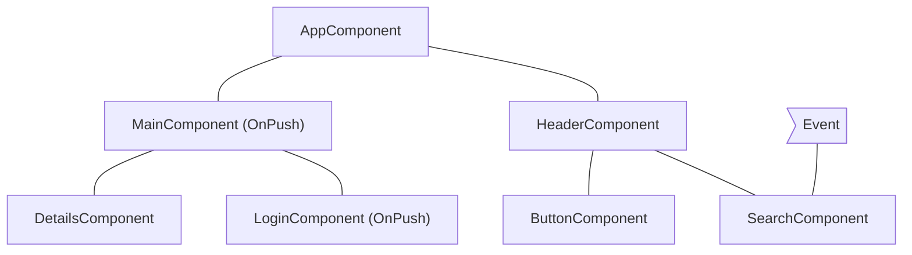
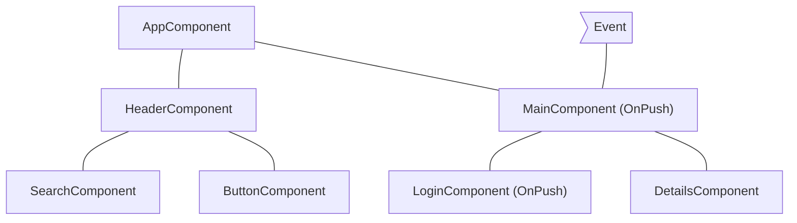
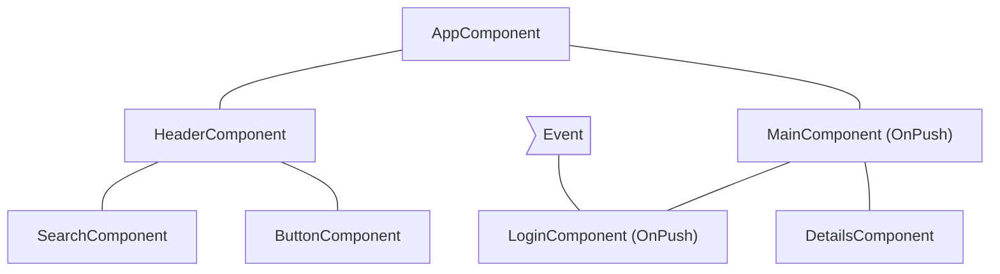
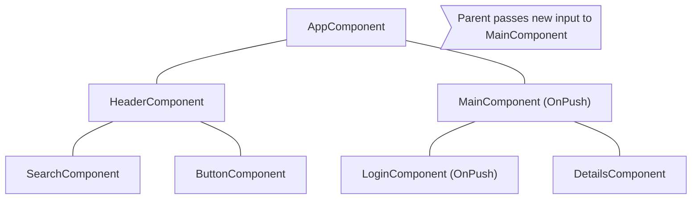

# 컴포넌트 서브트리 건너뛰기

JavaScript는 기본적으로 다양한 컴포넌트에서 참조할 수 있는 변경 가능한 데이터 구조를 사용합니다. Angular는 컴포넌트 트리 전체에 대해 변경 감지를 실행하여 데이터 구조의 최신 상태가 DOM에 반영되도록 합니다.

변경 감지는 대부분의 애플리케이션에서 충분히 빠릅니다. 그러나 애플리케이션에 특별히 큰 컴포넌트 트리가 있는 경우 전체 애플리케이션에 걸쳐 변경 감지를 실행하면 성능 문제가 발생할 수 있습니다. 이를 해결하기 위해 변경 감지를 컴포넌트 트리의 일부에만 실행되도록 구성할 수 있습니다.

애플리케이션의 일부가 상태 변경의 영향을 받지 않는다고 확신하는 경우 [OnPush](/api/core/ChangeDetectionStrategy)를 사용하여 전체 컴포넌트 서브트리에서 변경 감지를 건너뜁니다.

## `OnPush` 사용하기

OnPush 변경 감지는 Angular에게 다음 경우에만 컴포넌트 서브트리에 대해 변경 감지를 실행하도록 지시합니다:

* 서브트리의 루트 컴포넌트가 템플릿 바인딩의 결과로 새로운 입력을 받을 때. Angular는 입력의 현재 값과 과거 값을 `==`로 비교합니다.
* Angular가 서브트리의 루트 컴포넌트 또는 자식 컴포넌트에서 이벤트를 처리할 때 _(예: 이벤트 바인딩, 출력 바인딩 또는 `@HostListener` 사용)_, OnPush 변경 감지를 사용하든 그렇지 않든 상관없습니다.

`@Component` 데코레이터에서 컴포넌트의 변경 감지 전략을 `OnPush`로 설정할 수 있습니다:

```ts
import { ChangeDetectionStrategy, Component } from '@angular/core';
@Component({
  changeDetection: ChangeDetectionStrategy.OnPush,
})
export class MyComponent {}
```

## 일반적인 변경 감지 시나리오

이 섹션에서는 Angular의 동작을 설명하기 위해 여러 일반적인 변경 감지 시나리오를 살펴봅니다.

### 기본 변경 감지를 사용하는 컴포넌트에서 이벤트 처리

Angular가 `OnPush` 전략 없이 컴포넌트 내에서 이벤트를 처리하면 프레임워크는 전체 컴포넌트 트리에 대해 변경 감지를 실행합니다. Angular는 새로운 입력을 받지 않은 `OnPush`를 사용하는 루트를 가진 자식 컴포넌트 서브트리를 건너뜁니다.

예를 들어, `MainComponent`의 변경 감지 전략을 `OnPush`로 설정하고 사용자가 `MainComponent`의 루트 외부에서 컴포넌트와 상호작용하면, Angular는 `MainComponent`가 새로운 입력을 받지 않는 한 아래 다이어그램의 모든 핑크색 컴포넌트(`AppComponent`, `HeaderComponent`, `SearchComponent`, `ButtonComponent`)를 확인합니다:



## OnPush가 있는 컴포넌트에서 이벤트 처리

Angular가 OnPush 전략이 있는 컴포넌트 내에서 이벤트를 처리하면 프레임워크는 전체 컴포넌트 트리 내에서 변경 감지를 실행합니다. Angular는 새로운 입력을 받지 않고 이벤트를 처리한 컴포넌트 외부에 있는 `OnPush`를 사용하는 루트를 가진 컴포넌트 서브트리를 무시합니다.

예를 들어, Angular가 `MainComponent` 내에서 이벤트를 처리하는 경우 프레임워크는 전체 컴포넌트 트리에서 변경 감지를 실행합니다. Angular는 `LoginComponent`의 루트 서브트리를 무시하는데, 이는 `OnPush`를 사용하며 이벤트가 해당 범위 외부에서 발생했기 때문입니다.



## OnPush가 있는 컴포넌트의 자손에서 이벤트 처리

Angular가 OnPush가 있는 컴포넌트에서 이벤트를 처리하면 프레임워크는 컴포넌트의 조상(부모 컴포넌트)도 포함하여 전체 컴포넌트 트리에서 변경 감지를 실행합니다.

예를 들어, 아래 다이어그램에서 Angular는 OnPush를 사용하는 `LoginComponent` 내에서 이벤트를 처리합니다. Angular는 `MainComponent`(`LoginComponent`의 부모)도 포함하여 전체 컴포넌트 서브트리에서 변경 감지를 실행합니다. `MainComponent`도 `OnPush`를 가지고 있지만, `LoginComponent`가 그 뷰의 일부이기 때문에 Angular는 `MainComponent`도 확인합니다.



## OnPush가 있는 컴포넌트에 대한 새로운 입력

Angular는 템플릿 바인딩의 결과로 입력 속성을 설정할 때 `OnPush`가 있는 자식 컴포넌트 내에서 변경 감지를 실행합니다.

예를 들어, 아래 다이어그램에서는 `AppComponent`가 `OnPush`가 있는 `MainComponent`에 새로운 입력을 전달합니다. Angular는 `MainComponent`에서 변경 감지를 실행하지만, 새로운 입력을 받지 않는 한 `LoginComponent`에서 변경 감지는 실행하지 않습니다.



## 예외 사례

* **TypeScript 코드에서 입력 속성 수정**. TypeScript에서 `@ViewChild`나 `@ContentChild`와 같은 API를 사용하여 컴포넌스를 참조하고 `@Input` 속성을 수동으로 수정할 때, Angular는 OnPush 컴포넌트에 대해 자동으로 변경 감지를 실행하지 않습니다. Angular가 변경 감지를 실행하도록 하려면 컴포넌트에 `ChangeDetectorRef`를 주입하고 `changeDetectorRef.markForCheck()`를 호출하여 Angular에 변경 감지를 예약하도록 알릴 수 있습니다.
* **객체 참조 수정**. 입력이 변경 가능한 객체를 값으로 받고 객체를 수정하지만 참조를 유지하는 경우, Angular는 변경 감지를 실행하지 않습니다. 이는 입력의 이전 값과 현재 값이 동일한 참조를 가리키기 때문에 예상되는 동작입니다.