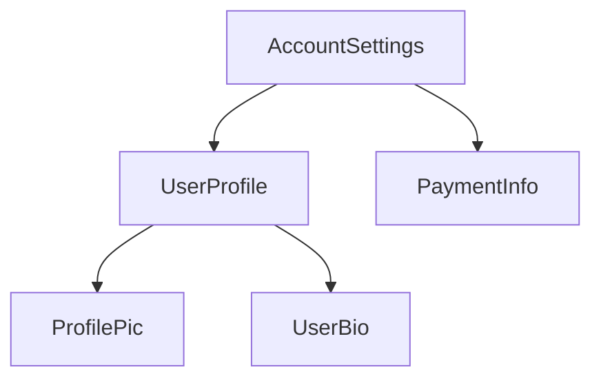

<docs-decorative-header title="구성 요소의 구조" imgSrc="adev/src/assets/images/components.svg"> <!-- markdownlint-disable-line -->
</docs-decorative-header>

팁: 이 가이드는 사용자가 [필수 가이드](essentials)를 이미 읽었다고 가정합니다. Angular에 익숙하지 않다면 먼저 그것을 읽어보세요.

모든 구성 요소는 다음을 가져야 합니다:

* 사용자 입력을 처리하고 서버에서 데이터를 가져오는 등의 _행동_을 가진 TypeScript 클래스
* DOM에 렌더링되는 내용을 제어하는 HTML 템플릿
* HTML에서 구성 요소가 어떻게 사용되는지 정의하는 [CSS 선택자](https://developer.mozilla.org/docs/Learn/CSS/Building_blocks/Selectors)

TypeScript 클래스 위에 `@Component` [데코레이터](https://www.typescriptlang.org/docs/handbook/decorators.html)를 추가하여 Angular 특정 정보를 구성 요소에 제공합니다:

<docs-code language="angular-ts" highlight="[1, 2, 3, 4]">
@Component({
  selector: 'profile-photo',
  template: ``,
})
export class ProfilePhoto { }
</docs-code>

데이터 바인딩, 이벤트 처리 및 제어 흐름을 포함하여 Angular 템플릿 작성에 대한 전체 내용은 [템플릿 가이드](guide/templates)를 참조하세요.

`@Component` 데코레이터에 전달된 객체를 구성 요소의 **메타데이터**라고 합니다. 여기에는 이 가이드를 통해 설명된 `selector`, `template` 및 기타 속성이 포함됩니다.

구성 요소는 해당 구성 요소의 DOM에 적용되는 CSS 스타일 목록을 선택적으로 포함할 수 있습니다:

<docs-code language="angular-ts" highlight="[4]">
@Component({
  selector: 'profile-photo',
  template: ``,
  styles: `img { border-radius: 50%; }`,
})
export class ProfilePhoto { }
</docs-code>

기본적으로 구성 요소의 스타일은 해당 구성 요소의 템플릿에서 정의된 요소에만 영향을 미칩니다. Angular의 스타일링 접근 방식에 대한 자세한 내용은 [구성 요소 스타일링](guide/components/styling)을 참조하세요.

템플릿과 스타일을 별도의 파일에 작성하도록 선택할 수도 있습니다:

<docs-code language="angular-ts" highlight="[3, 4]">
@Component({
  selector: 'profile-photo',
  templateUrl: 'profile-photo.html',
  styleUrl: 'profile-photo.css',
})
export class ProfilePhoto { }
</docs-code>

이는 프로젝트 내에서 _표현_과 _행동_의 우려를 분리하는 데 도움이 됩니다. 전체 프로젝트에 대해 하나의 접근 방식을 선택하거나 각 구성 요소에 사용할 방식을 결정할 수 있습니다.

`templateUrl` 및 `styleUrl`은 구성 요소가 존재하는 디렉토리에 상대적입니다.

## 구성 요소 사용하기

### `@Component` 데코레이터의 가져오기

구성 요소, [지시문](guide/directives) 또는 [파이프](guide/templates/pipes)를 사용하려면 `@Component` 데코레이터의 `imports` 배열에 추가해야 합니다:

```angular-ts
import {ProfilePhoto} from './profile-photo';

@Component({
  // 이 구성 요소의 템플릿에서 사용하기 위해 
  // `ProfilePhoto` 구성 요소를 가져옵니다.
  imports: [ProfilePhoto],
  /* ... */
})
export class UserProfile { }
```

기본적으로 Angular 구성 요소는 *독립형*입니다. 즉, 다른 구성 요소의 `imports` 배열에 직접 추가할 수 있습니다. 이전 버전의 Angular로 생성된 구성 요소는 대신 `@Component` 데코레이터에 `standalone: false`를 지정할 수 있습니다. 이러한 구성 요소의 경우 구성 요소가 정의된 `NgModule`을 가져와야 합니다. 자세한 내용은 전체 [`NgModule` 가이드](guide/ngmodules)를 참조하세요.

중요: Angular 19.0.0 이전 버전에서는 `standalone` 옵션이 기본적으로 `false`입니다.

### 템플릿에서 구성 요소 표시하기

모든 구성 요소는 [CSS 선택자](https://developer.mozilla.org/docs/Learn/CSS/Building_blocks/Selectors)를 정의합니다:

<docs-code language="angular-ts" highlight="[2]">
@Component({
  selector: 'profile-photo',
  ...
})
export class ProfilePhoto { }
</docs-code>

Angular가 지원하는 선택자 유형 및 선택자 선택에 대한 지침은 [구성 요소 선택자](guide/components/selectors)를 참조하세요.

다른 구성 요소의 템플릿에서 일치하는 HTML 요소를 생성하여 구성 요소를 표시합니다:

<docs-code language="angular-ts" highlight="[8]">
@Component({
  selector: 'profile-photo',
})
export class ProfilePhoto { }

@Component({
  imports: [ProfilePhoto],
  template: `<profile-photo />`
})
export class UserProfile { }
</docs-code>

Angular는 일치하는 HTML 요소를 찾을 때마다 구성 요소의 인스턴스를 생성합니다. 구성 요소의 선택자와 일치하는 DOM 요소는 해당 구성 요소의 **호스트 요소**라고 합니다. 구성 요소 템플릿의 내용은 해당 호스트 요소 안에 렌더링됩니다.

구성 요소가 렌더링한 DOM은 해당 구성 요소의 템플릿에 해당하며, 이를 해당 구성 요소의 **뷰**라고 합니다.

이런 방식으로 구성 요소를 구성하면 **Angular 애플리케이션을 구성 요소의 트리로 생각할 수 있습니다.** 



이 트리 구조는 여러 다른 Angular 개념, 즉 [의존성 주입](guide/di) 및 [자식 쿼리](guide/components/queries)를 이해하는 데 중요합니다.