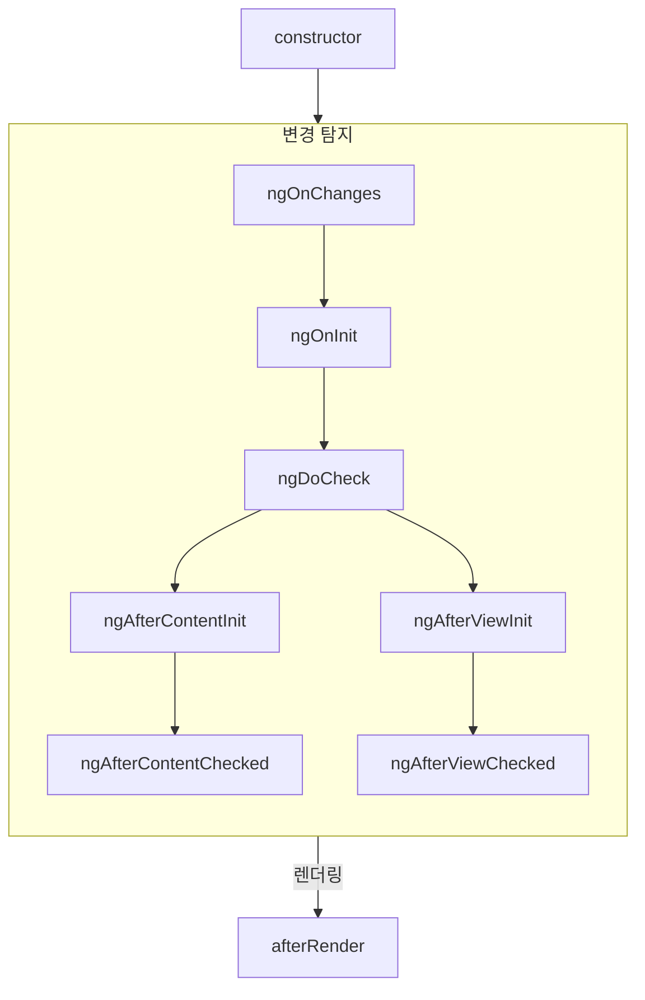
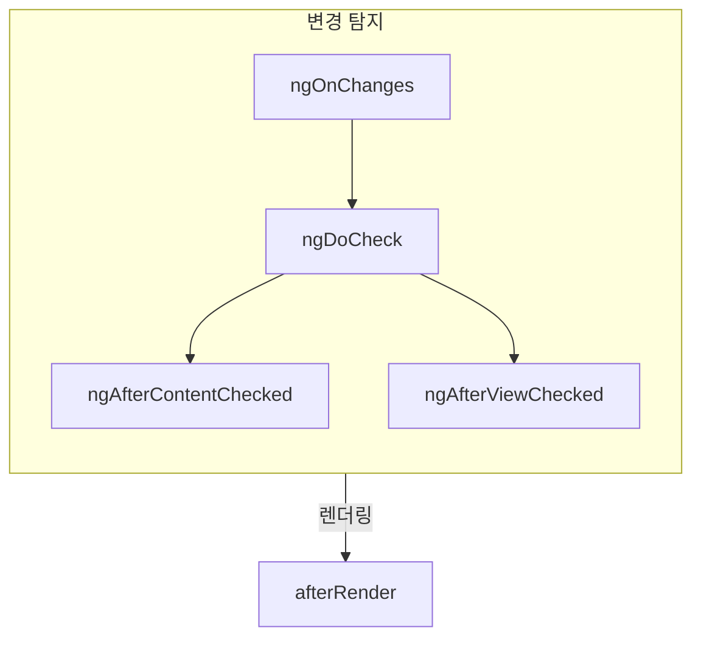

# 구성요소 생명 주기

팁: 이 가이드는 여러분이 이미 [필수 가이드](essentials)를 읽었다고 가정합니다. Angular에 처음이라면 먼저 읽으세요.

구성요소의 **생명 주기**는 구성요소의 생성과 파괴 사이에 발생하는 단계의 순서입니다. 각 단계는 Angular가 구성요소를 렌더링하고 시간이 지남에 따라 업데이트를 확인하는 과정의 다른 부분을 나타냅니다.

구성요소에서 **생명 주기 훅**을 구현하여 이러한 단계 동안 코드를 실행할 수 있습니다. 특정 구성요소 인스턴스와 관련된 생명 주기 훅은 구성요소 클래스의 메서드로 구현됩니다. Angular 애플리케이션 전체와 관련된 생명 주기 훅은 콜백을 수용하는 함수로 구현됩니다.

구성요소의 생명 주기는 Angular가 시간이 지남에 따라 구성요소의 변경을 확인하는 방식과 밀접하게 연결되어 있습니다. 이 생명 주기를 이해하기 위한 목적상, Angular는 애플리케이션 트리를 위에서 아래로 이동하면서 템플릿 바인딩의 변경 여부를 확인한다는 것만 알면 됩니다. 다음에 설명한 생명 주기 훅은 Angular가 이 탐색을 수행하는 동안 실행됩니다. 이 탐색은 각 구성요소를 정확히 한 번 방문하므로 프로세스 중간에 추가 상태 변경을 피해야 합니다.

## 요약

<div class="docs-table docs-scroll-track-transparent">
  <table>
    <tr>
      <td><strong>단계</strong></td>
      <td><strong>메서드</strong></td>
      <td><strong>요약</strong></td>
    </tr>
    <tr>
      <td>생성</td>
      <td><code>constructor</code></td>
      <td>
        <a href="https://developer.mozilla.org/docs/Web/JavaScript/Reference/Classes/constructor" target="_blank">
          표준 JavaScript 클래스 생성자
        </a>. Angular가 구성요소를 인스턴스화할 때 실행됩니다.
      </td>
    </tr>
    <tr>
      <td rowspan="7">변경<p>탐지</td>
      <td><code>ngOnInit</code>
      </td>
      <td>Angular가 모든 구성 요소의 입력을 초기화한 후 한 번 실행됩니다.</td>
    </tr>
    <tr>
      <td><code>ngOnChanges</code></td>
      <td>구성요소의 입력이 변경될 때마다 실행됩니다.</td>
    </tr>
    <tr>
      <td><code>ngDoCheck</code></td>
      <td>이 구성요소가 변경 사항을 확인할 때마다 실행됩니다.</td>
    </tr>
    <tr>
      <td><code>ngAfterContentInit</code></td>
      <td>구성요소의 <em>내용</em>이 초기화된 후 한 번 실행됩니다.</td>
    </tr>
    <tr>
      <td><code>ngAfterContentChecked</code></td>
      <td>이 구성 요소의 내용이 변경된 여부를 확인할 때마다 실행됩니다.</td>
    </tr>
    <tr>
      <td><code>ngAfterViewInit</code></td>
      <td>구성요소의 <em>뷰</em>가 초기화된 후 한 번 실행됩니다.</td>
    </tr>
    <tr>
      <td><code>ngAfterViewChecked</code></td>
      <td>구성 요소의 뷰가 변경된 여부를 확인할 때마다 실행됩니다.</td>
    </tr>
    <tr>
      <td rowspan="2">렌더링</td>
      <td><code>afterNextRender</code></td>
      <td><strong>모든</strong> 구성요소가 DOM에 렌더링된 다음 한 번 실행됩니다.</td>
    </tr>
    <tr>
      <td><code>afterRender</code></td>
      <td><strong>모든</strong> 구성요소가 DOM에 렌더링될 때마다 실행됩니다.</td>
    </tr>
    <tr>
      <td>파괴</td>
      <td><code>ngOnDestroy</code></td>
      <td>구성요소가 파괴되기 전에 한 번 실행됩니다.</td>
    </tr>
  </table>
</div>

### ngOnInit

`ngOnInit` 메서드는 Angular가 모든 구성 요소의 입력을 초기값으로 초기화한 후 실행됩니다. 구성 요소의 `ngOnInit`은 정확히 한 번 실행됩니다.

이 단계는 구성 요소의 템플릿이 초기화되기 _전_에 발생합니다. 이는 구성 요소의 상태를 초기 입력 값에 따라 업데이트할 수 있음을 의미합니다.

### ngOnChanges

`ngOnChanges` 메서드는 구성 요소의 입력이 변경된 후 실행됩니다.

이 단계는 구성 요소의 템플릿이 확인되기 _전_에 발생합니다. 이는 구성 요소의 상태를 초기 입력 값에 따라 업데이트할 수 있음을 의미합니다.

초기화 중, 첫 번째 `ngOnChanges`는 `ngOnInit`보다 먼저 실행됩니다.

#### 변경 사항 검사

`ngOnChanges` 메서드는 하나의 `SimpleChanges` 인수를 수용합니다. 이 객체는 각 구성요소 입력 이름을 `SimpleChange` 객체에 매핑하는 [`Record`](https://www.typescriptlang.org/docs/handbook/utility-types.html#recordkeys-type)입니다. 각 `SimpleChange`에는 입력의 이전 값, 현재 값 및 입력이 변경된 첫 번째 인지 여부를 나타내는 플래그가 포함됩니다.

```ts
@Component({
  /* ... */
})
export class UserProfile {
  @Input() name: string = '';

  ngOnChanges(changes: SimpleChanges) {
    for (const inputName in changes) {
      const inputValues = changes[inputName];
      console.log(`이전 ${inputName} == ${inputValues.previousValue}`);
      console.log(`현재 ${inputName} == ${inputValues.currentValue}`);
      console.log(`첫 번째 ${inputName} 변경인지 == ${inputValues.firstChange}`);
    }
  }
}
```

입력 속성에 `alias`를 제공하는 경우, `SimpleChanges` Record는 여전히 TypeScript 속성 이름을 키로 사용하고 별칭은 사용하지 않습니다.

### ngOnDestroy

`ngOnDestroy` 메서드는 구성 요소가 파괴되기 직전에 한 번 실행됩니다. Angular는 페이지에 더 이상 표시되지 않는 구성요소를 파괴합니다. 예를 들어 `@if`에 의해 숨겨지거나 다른 페이지로 이동할 때입니다.

#### DestroyRef

`ngOnDestroy` 메서드 대신 `DestroyRef`의 인스턴스를 주입할 수 있습니다. `DestroyRef`의 `onDestroy` 메서드를 호출하여 구성 요소가 파괴될 때 호출될 콜백을 등록할 수 있습니다.

```ts
@Component({
  /* ... */
})
export class UserProfile {
  constructor(private destroyRef: DestroyRef) {
    destroyRef.onDestroy(() => {
      console.log('UserProfile 파괴');
    });
  }
}
```

구성 요소 외부의 함수나 클래스에도 `DestroyRef` 인스턴스를 전달할 수 있습니다. 구성 요소가 파괴될 때 일부 정리 동작을 실행하는 다른 코드가 있는 경우 이 패턴을 사용하세요.

또한 `ngOnDestroy` 메서드에 모든 정리 코드를 넣는 대신 `DestroyRef`를 사용하여 설정 코드와 정리 코드를 가까이 유지할 수 있습니다.

### ngDoCheck

`ngDoCheck` 메서드는 Angular가 구성 요소의 템플릿을 변경 여부를 확인하기 전마다 실행됩니다.

이 생명 주기 훅을 사용하여 Angular의 정상적인 변경 탐지를 벗어나 상태 변경을 수동으로 확인하고 구성 요소의 상태를 수동으로 업데이트할 수 있습니다.

이 메서드는 매우 자주 실행되며 페이지의 성능에 상당한 영향을 미칠 수 있습니다. 가능한 경우 이 훅을 정의하지 않도록 하며, 대안이 없는 경우에만 사용하세요.

초기화 중, 첫 번째 `ngDoCheck`은 `ngOnInit` 이후에 실행됩니다.

### ngAfterContentInit

`ngAfterContentInit` 메서드는 구성 요소 내부에 중첩된 모든 자식 (_content_)이 초기화된 후 한 번 실행됩니다.

이 생명 주기 훅을 사용하여 [내용 쿼리](guide/components/queries#content-queries)의 결과를 읽을 수 있습니다. 이러한 쿼리의 초기화된 상태에 접근할 수 있지만 이 메서드에서 상태를 변경하려고 시도하면 [ExpressionChangedAfterItHasBeenCheckedError](errors/NG0100)가 발생합니다.

### ngAfterContentChecked

`ngAfterContentChecked` 메서드는 구성 요소 내부에 중첩된 자식 (_content_)이 변경 여부를 확인할 때마다 실행됩니다.

이 메서드는 매우 자주 실행되며 페이지의 성능에 상당한 영향을 미칠 수 있습니다. 가능한 경우 이 훅을 정의하지 않도록 하며, 대안이 없는 경우에만 사용하세요.

여기에서 [내용 쿼리](guide/components/queries#content-queries)의 업데이트된 상태에 접근할 수 있지만 이 메서드에서 상태를 변경하려고 시도하면 [ExpressionChangedAfterItHasBeenCheckedError](errors/NG0100)가 발생합니다.

### ngAfterViewInit

`ngAfterViewInit` 메서드는 구성 요소의 템플릿 (_view_)에 있는 모든 자식이 초기화된 후 한 번 실행됩니다.

이 생명 주기 훅을 사용하여 [뷰 쿼리](guide/components/queries#view-queries)의 결과를 읽을 수 있습니다. 이러한 쿼리의 초기화된 상태에 접근할 수 있지만 이 메서드에서 상태를 변경하려고 시도하면 [ExpressionChangedAfterItHasBeenCheckedError](errors/NG0100)가 발생합니다.

### ngAfterViewChecked

`ngAfterViewChecked` 메서드는 구성 요소의 템플릿 (_view_)에 있는 자식이 변경 여부를 확인할 때마다 실행됩니다.

이 메서드는 매우 자주 실행되며 페이지의 성능에 상당한 영향을 미칠 수 있습니다. 가능한 경우 이 훅을 정의하지 않도록 하며, 대안이 없는 경우에만 사용하세요.

여기에서 [뷰 쿼리](guide/components/queries#view-queries)의 업데이트된 상태에 접근할 수 있지만 이 메서드에서 상태를 변경하려고 시도하면 [ExpressionChangedAfterItHasBeenCheckedError](errors/NG0100)가 발생합니다.

### afterRender 및 afterNextRender

`afterRender` 및 `afterNextRender` 함수는 Angular가 페이지의 _모든 구성요소_를 DOM에 렌더링한 후 호출될 **렌더 콜백**을 등록할 수 있게 해줍니다.

이 함수들은 이 가이드에 설명된 다른 생명 주기 훅과 다릅니다. 클래스 메서드가 아닌 콜백을 수용하는 독립형 함수입니다. 렌더 콜백의 실행은 특정 구성 요소 인스턴스에 묶이지 않고 애플리케이션 전역 훅에 tied됩니다.

`afterRender` 및 `afterNextRender`는 [주입 컨텍스트](guide/di/dependency-injection-context), 일반적으로 구성 요소의 생성자 내에서 호출되어야 합니다.

수동 DOM 작업을 수행하는 데 렌더 콜백을 사용할 수 있습니다. Angular에서 DOM 작업에 대한 가이드는 [DOM API 사용](guide/components/dom-apis)을 참조하세요.

렌더 콜백은 서버 측 렌더링 또는 빌드 타임 미리 렌더링 중에 실행되지 않습니다.

#### afterRender 단계

`afterRender` 또는 `afterNextRender`를 사용할 때 작업을 단계별로 나눌 수 있습니다. 단계는 DOM 작업의 순서를 제어할 수 있게 해주며, _쓰기_ 작업을 _읽기_ 작업보다 먼저 순서대로 방출하여 [레이아웃 난수화](https://web.dev/avoid-large-complex-layouts-and-layout-thrashing)를 최소화할 수 있습니다. 단계 간에 통신하려면 단계 함수가 다음 단계에서 액세스할 수 있는 결과 값을 반환할 수 있습니다.

```ts
import {Component, ElementRef, afterNextRender} from '@angular/core';

@Component({...})
export class UserProfile {
  private prevPadding = 0;
  private elementHeight = 0;

  constructor(elementRef: ElementRef) {
    const nativeElement = elementRef.nativeElement;

    afterNextRender({
      // 기하학적 속성에 쓰기 위해 `Write` 단계를 사용합니다.
      write: () => {
        const padding = computePadding();
        const changed = padding !== this.prevPadding;
        if (changed) {
          nativeElement.style.padding = padding;
        }
        return changed; // 읽기 단계에 변경된 것이 있는지 통신합니다.
      },

      // 모든 쓰기가 발생한 후 기하학적 속성을 읽기 위해 `Read` 단계를 사용합니다.
      read: (didWrite) => {
        if (didWrite) {
          this.elementHeight = nativeElement.getBoundingClientRect().height;
        }
      }
    });
  }
}
```

다음과 같이 네 개의 단계가 있습니다:

| 단계            | 설명                                                                                                                                                                                        |
| ---------------- | ------------------------------------------------------------------------------------------------------------------------------------------------------------------------------------------- |
| `earlyRead`      | 후속 계산에 엄격히 필요한 DOM 속성 및 스타일을 읽기 위해 이 단계를 사용하세요. 가능한 경우 이 단계를 피하고 `write` 및 `read` 단계를 선호하세요.                                       |
| `mixedReadWrite` | 기본 단계. 레이아웃에 영향을 미치는 속성과 스타일을 읽고 쓰기 위해 필요할 때 사용하세요. 가능한 경우 이 단계를 피하고 명시적인 `write` 및 `read` 단계를 선호하세요.                  |
| `write`          | 레이아웃에 영향을 미치는 DOM 속성과 스타일을 쓰기 위해 이 단계를 사용하세요.                                                                                                                                   |
| `read`           | 레이아웃에 영향을 미치는 DOM 속성을 읽기 위해 이 단계를 사용하세요.                                                                                                                                           |

## 생명 주기 인터페이스

Angular는 각 생명 주기 메서드에 대해 TypeScript 인터페이스를 제공합니다. 이러한 인터페이스를 선택적으로 가져와서 `implement`하여 구현에 오타나 잘못 표기된 부분이 없도록 할 수 있습니다.

각 인터페이스는 해당 메서드와 같은 이름을 가지며 `ng` 접두사가 없습니다. 예를 들어 `ngOnInit`의 인터페이스는 `OnInit`입니다.

```ts
@Component({
  /* ... */
})
export class UserProfile implements OnInit {
  ngOnInit() {
    /* ... */
  }
}
```

## 실행 순서

다음 다이어그램은 Angular의 생명 주기 훅의 실행 순서를 보여줍니다.

### 초기화 중



### 후속 업데이트



### 지시문으로 정렬

하나 이상의 지시문을 템플릿의 구성 요소와 같은 요소에 표시하는 경우, 해당 구성 요소의 특정 생명 주기 훅에 대한 순서를 보장하지 않습니다. 관찰된 순서에 의존하지 마세요. 이는 Angular의 이후 버전에서 변경될 수 있습니다.