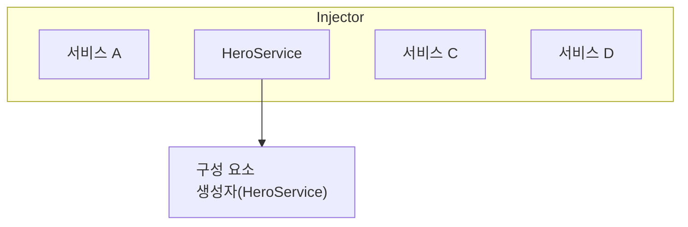

# 의존성 주입 이해하기

의존성 주입(Dependency Injection, DI)은 Angular의 기본 개념 중 하나입니다. DI는 Angular 프레임워크에 내장되어 있으며, 구성 요소, 지시문, 파이프 및 주입 가능 요소와 같은 Angular 데코레이터가 있는 클래스가 필요한 의존성을 구성할 수 있게 해줍니다.

DI 시스템에는 두 가지 주요 역할이 있습니다: 의존성 소비자와 의존성 제공자입니다.

Angular는 `Injector`라는 추상화를 사용하여 의존성 소비자와 의존성 제공자 간의 상호작용을 용이하게 합니다. 의존성이 요청되면 인젝터는 등록소를 확인하여 그곳에 이미 사용 가능한 인스턴스가 있는지 확인합니다. 그렇지 않으면 새로운 인스턴스가 생성되어 등록소에 저장됩니다. Angular는 애플리케이션 부트스트랩 프로세스 중에 애플리케이션 전역 인젝터(루트 인젝터로도 알려짐)를 생성합니다. 대부분의 경우 인젝터를 수동으로 생성할 필요는 없지만, 제공자와 소비자를 연결하는 레이어가 있다는 것을 알고 있어야 합니다.

이 주제에서는 클래스가 의존성으로 작용할 수 있는 기본 시나리오를 다룹니다. Angular는 또한 함수, 객체, 문자열 또는 불리언과 같은 기본 타입, 또는 기타 종류의 의존성을 사용하는 것을 허용합니다. 더 많은 정보는 [의존성 제공자](guide/di/dependency-injection-providers)를 참조하세요.

## 의존성 제공하기

구성 요소에서 의존성 역할을 해야 하는 `HeroService`라는 클래스를 고려해 보세요.

첫 번째 단계는 클래스가 주입될 수 있음을 나타내기 위해 `@Injectable` 데코레이터를 추가하는 것입니다.

<docs-code language="typescript" highlight="[1]">
@Injectable()
class HeroService {}
</docs-code>

다음 단계는 제공하여 DI에서 이를 사용할 수 있도록 만드는 것입니다.
의존성은 여러 장소에서 제공될 수 있습니다:

* [**선호됨**: `providedIn`을 사용하여 애플리케이션 루트 수준에서.](#preferred-at-the-application-root-level-using-providedin)
* [구성 요소 수준에서.](#at-the-component-level)
* [ApplicationConfig를 사용하여 애플리케이션 루트 수준에서.](#at-the-application-root-level-using-applicationconfig)
* [`NgModule` 기반 애플리케이션에서.](#ngmodule-based-applications)

### **선호됨**: `providedIn`을 사용하여 애플리케이션 루트 수준에서

`providedIn`을 사용하여 애플리케이션 루트 수준에서 서비스를 제공하면 모든 다른 클래스에 서비스를 주입할 수 있습니다.
`providedIn`을 사용하면 Angular와 JavaScript 코드 최적화 도구가 사용되지 않는 서비스를 효과적으로 제거할 수 있습니다(트리 쉐이킹).

`@Injectable` 데코레이터에서 `providedIn: 'root'`를 사용하여 서비스를 제공할 수 있습니다:

<docs-code language="typescript" highlight="[2]">
@Injectable({
  providedIn: 'root'
})
class HeroService {}
</docs-code>

루트 수준에서 서비스를 제공하면 Angular는 `HeroService`의 단일 공유 인스턴스를 생성하여 이를 요청하는 모든 클래스에 주입합니다.

### 구성 요소 수준에서

`@Component` 데코레이터의 `providers` 필드를 사용하여 `@Component` 수준에서 서비스를 제공할 수 있습니다.
이 경우 `HeroService`는 이 구성 요소의 모든 인스턴스와 템플릿에서 사용하는 다른 구성 요소 및 지시문에서 사용할 수 있게 됩니다.

예를 들어:

<docs-code language="typescript" highlight="[4]">
@Component({
  selector: 'hero-list',
  template: '...',
  providers: [HeroService]
})
class HeroListComponent {}
</docs-code>

구성 요소 수준에서 제공자를 등록하면 각 새 인스턴스의 서비스에 대한 새로운 인스턴스를 얻게 됩니다.

참고: 이렇게 서비스를 선언하면 서비스가 사용되지 않더라도 항상 애플리케이션에 `HeroService`가 포함됩니다.

### ApplicationConfig를 사용하여 애플리케이션 루트 수준에서

`bootstrapApplication` 함수에 전달된 `ApplicationConfig`의 `providers` 필드를 사용하여 애플리케이션 수준에서 서비스나 다른 `Injectable`을 제공할 수 있습니다.

아래 예제에서 `HeroService`는 모든 구성 요소, 지시문 및 파이프에서 사용 가능합니다:

<docs-code language="typescript" highlight="[3]">
export const appConfig: ApplicationConfig = {
    providers: [
      { provide: HeroService },
    ]
};
</docs-code>

그런 다음 `main.ts`에서:

<docs-code language="typescript">
bootstrapApplication(AppComponent, appConfig)
</docs-code>

참고: 이렇게 서비스를 선언하면 서비스가 사용되지 않더라도 항상 애플리케이션에 `HeroService`가 포함됩니다.

### `NgModule` 기반 애플리케이션

`@NgModule` 기반 애플리케이션은 애플리케이션 수준에서 서비스나 다른 `Injectable`을 제공하기 위해 `@NgModule` 데코레이터의 `providers` 필드를 사용합니다.

모듈에 제공된 서비스는 모듈의 모든 선언에서 사용 가능하며, 동일한 `ModuleInjector`를 공유하는 다른 모듈에서도 사용 가능합니다.
모든 엣지 케이스를 이해하려면 [계층 인젝터](guide/di/hierarchical-dependency-injection)를 참조하세요.

참고: `providers`를 사용하여 서비스를 선언하면 서비스가 사용되지 않더라도 애플리케이션에 포함됩니다.

## 의존성 주입/소비하기

의존성을 주입하는 가장 일반적인 방법은 클래서 생성자에 선언하는 것입니다. Angular가 구성 요소, 지시문 또는 파이프 클래스의 새 인스턴스를 생성할 때, 생성자 매개변수 타입을 확인하여 해당 클래스가 필요한 서비스나 다른 의존성을 결정합니다. 예를 들어, `HeroListComponent`가 `HeroService`가 필요하다면, 생성자는 다음과 같이 보일 수 있습니다:

<docs-code language="typescript" highlight="[3]">
@Component({ … })
class HeroListComponent {
  constructor(private service: HeroService) {}
}
</docs-code>

또 다른 옵션은 [inject](api/core/inject) 메서드를 사용하는 것입니다:

<docs-code language="typescript" highlight="[3]">
@Component({ … })
class HeroListComponent {
  private service = inject(HeroService);
}
</docs-code>

Angular가 구성 요소가 서비스에 의존한다는 것을 발견하면, 먼저 인젝터에 해당 서비스의 기존 인스턴스가 있는지 확인합니다. 요청된 서비스 인스턴스가 아직 존재하지 않으면, 인젝터는 등록된 제공자를 사용하여 하나를 생성하고 이것을 인젝터에 추가한 후 Angular에 서비스를 반환합니다.

모든 요청된 서비스가 해결되고 반환되면, Angular는 해당 서비스를 인수로 사용하여 구성 요소의 생성자를 호출할 수 있습니다.

## 다음 단계

<docs-pill-row>
  <docs-pill href="/guide/di/creating-injectable-service" title="주입 가능한 서비스 생성하기"/>
</docs-pill-row>