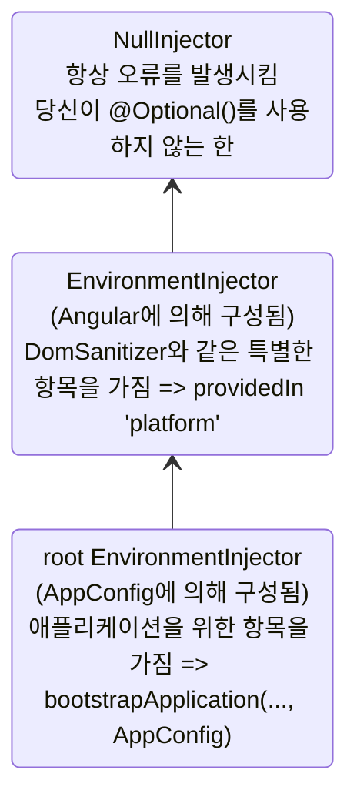
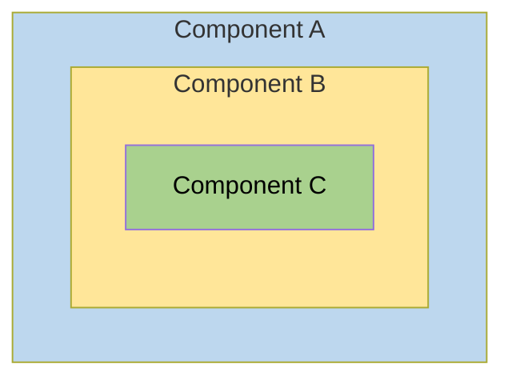
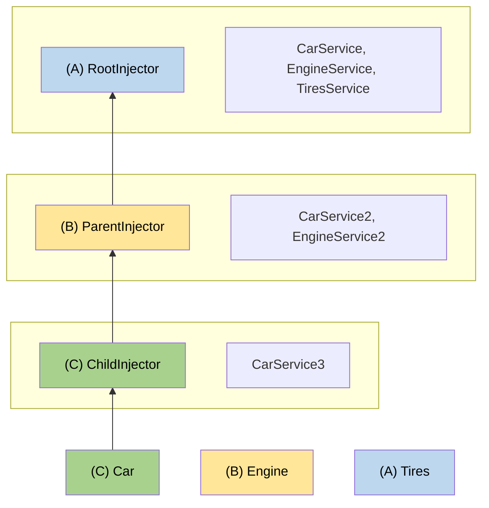

# 계층적 주입기

Angular의 주입기에는 애플리케이션에서 주입 가능한 항목의 원하는 가시성을 얻기 위해 활용할 수 있는 규칙이 있습니다.
이러한 규칙을 이해함으로써 애플리케이션 수준, 컴포넌트 수준 또는 지시자 수준에서 공급자를 선언할지를 결정할 수 있습니다.

Angular로 구축하는 애플리케이션은 꽤 커질 수 있으며, 이러한 복잡성을 관리하는 한 가지 방법은 애플리케이션을 잘 정의된 컴포넌트 트리로 나누는 것입니다.

페이지의 특정 섹션은 애플리케이션의 나머지 부분과 완전히 독립적으로 작동할 수 있으며, 필요한 서비스 및 기타 종속성의 로컬 복사본을 가질 수 있습니다.
이러한 애플리케이션의 섹션이 사용하는 서비스 중 일부는 애플리케이션의 다른 부분이나 컴포넌트 트리 상위의 부모 컴포넌트와 공유될 수 있지만, 다른 종속성은 비공식적으로 유지됩니다.

계층적 의존성 주입을 사용하면 애플리케이션의 섹션을 격리하고 나머지 애플리케이션과 공유되지 않는 고유한 비공식 종속성을 부여하거나, 부모 컴포넌트가 자식 컴포넌트와만 특정 종속성을 공유하게 할 수 있습니다. 계층적 의존성 주입을 통해 다른 부분 간의 종속성을 필요할 때만 공유할 수 있습니다.

## 주입기 계층의 유형

Angular에는 두 가지 주입기 계층이 있습니다:

| 주입기 계층                  | 세부 사항 |
|:---                       |:---     |
| `EnvironmentInjector` 계층 | `@Injectable()` 또는 `ApplicationConfig`의 `providers` 배열을 사용하여 이 계층에서 `EnvironmentInjector`를 구성합니다. |
| `ElementInjector` 계층     | 각 DOM 요소에서 암묵적으로 생성됩니다. `ElementInjector`는 `@Directive()` 또는 `@Component()`의 `providers` 속성에서 구성하지 않는 한 기본값으로 비어 있습니다. |

<docs-callout title="NgModule 기반 애플리케이션">
`NgModule` 기반 애플리케이션의 경우, `@NgModule()` 또는 `@Injectable()` 주석을 사용하여 `ModuleInjector` 계층으로 종속성을 제공할 수 있습니다.
</docs-callout>

### `EnvironmentInjector`

`EnvironmentInjector`는 다음 두 가지 방법 중 하나로 구성할 수 있습니다:

* `@Injectable()`의 `providedIn` 속성을 사용하여 `root` 또는 `platform`을 참조
* `ApplicationConfig`의 `providers` 배열

<docs-callout title="트리 섭취 및 @Injectable()">

`@Injectable()`의 `providedIn` 속성을 사용하는 것이 `ApplicationConfig`의 `providers` 배열을 사용하는 것보다 바람직합니다. `@Injectable()` `providedIn`을 사용하면 최적화 도구가 트리 섭취를 수행할 수 있어, 애플리케이션에서 사용하지 않는 서비스를 제거합니다. 이는 더 작은 번들 크기로 이어집니다.

트리 섭취는 라이브러리에 특히 유용한데, 라이브러리를 사용하는 애플리케이션에서 주입할 필요가 없을 수 있습니다.

</docs-callout>

`EnvironmentInjector`는 `ApplicationConfig.providers`로 구성됩니다.

`@Injectable()`의 `providedIn`을 사용하여 서비스를 제공합니다:

<docs-code language="typescript" highlight="[4]">
import { Injectable } from '@angular/core';

@Injectable({
  providedIn: 'root'  // <--이 서비스는 루트 EnvironmentInjector에서 제공됩니다.
})
export class ItemService {
  name = 'telephone';
}

</docs-code>

`@Injectable()` 데코레이터는 서비스 클래스를 식별합니다.
`providedIn` 속성은 여기서 `root`인 특정 `EnvironmentInjector`를 구성하며, 이를 통해 서비스는 `root` `EnvironmentInjector`에서 사용할 수 있게 됩니다.

### ModuleInjector

`NgModule` 기반 애플리케이션의 경우, `ModuleInjector`는 다음 두 가지 방법 중 하나로 구성할 수 있습니다:

* `@Injectable()`의 `providedIn` 속성을 사용하여 `root` 또는 `platform`을 참조
* `@NgModule()`의 `providers` 배열

`ModuleInjector`는 `@NgModule.providers` 및 `NgModule.imports` 속성으로 구성됩니다. `ModuleInjector`는 재귀적으로 `NgModule.imports`를 따라 접근할 수 있는 모든 공급자 배열의 평면화입니다.

자식 `ModuleInjector` 계층은 다른 `@NgModules`를 지연 로딩할 때 생성됩니다.

### 플랫폼 주입기

`root` 위에는 추가 `EnvironmentInjector`와 `NullInjector()` 두 개의 주입기가 더 있습니다.

Angular가 다음을 사용하여 애플리케이션을 부트스트랩하는 방식을 고려하십시오 `main.ts`에서:

<docs-code language="javascript">
bootstrapApplication(AppComponent, appConfig);
</docs-code>

`bootstrapApplication()` 메서드는 `ApplicationConfig` 인스턴스에 의해 구성된 플랫폼 주입기의 자식 주입기를 생성합니다.
이것이 바로 `root` `EnvironmentInjector`입니다.

`platformBrowserDynamic()` 메서드는 플랫폼별 종속성을 포함하는 `PlatformModule`에 의해 구성된 주입기를 생성합니다.
이를 통해 여러 애플리케이션이 플랫폼 구성을 공유할 수 있습니다.
예를 들어, 브라우저는 여러 애플리케이션을 실행하더라도 URL 바가 하나만 있습니다.
`platformBrowser()` 함수를 사용하여 플랫폼 수준에서 추가 플랫폼별 제공자를 구성할 수 있도록 `extraProviders`를 제공할 수 있습니다.

계층에서 다음 부모 주입기는 `NullInjector()`로, 트리의 가장 위에 있습니다.
`NullInjector()`에서 서비스를 찾으려고 너무 위로 올라가면 `@Optional()`을 사용하지 않는 한 오류가 발생합니다. 궁극적으로 모든 것은 `NullInjector()`에서 끝나며 오류를 반환하거나 `@Optional()`의 경우 `null`을 반환합니다.
`@Optional()`에 대한 자세한 내용은 이 가이드의 [`@Optional()` 섹션](#optional)을 참조하십시오.

다음 다이어그램은 `root` `ModuleInjector`와 이전 단락에서 설명한 상위 주입기 간의 관계를 나타냅니다.



`root`이라는 이름은 특별한 별칭이지만, 다른 `EnvironmentInjector` 계층은 별칭을 가지고 있지 않습니다.
동적으로 로드된 컴포넌트를 생성할 때마다 `EnvironmentInjector` 계층을 만들 수 있는 선택권이 있습니다. 예를 들어, 라우터를 사용할 때 자식 `EnvironmentInjector` 계층을 생성합니다.

모든 요청은 루트 주입기로 전달됩니다. `bootstrapApplication()` 메서드에 전달된 `ApplicationConfig` 인스턴스로 구성했든, 각 서비스에 `root`로 등록된 모든 제공자에서 제공된 것이든 상관없이 말입니다.

<docs-callout title="@Injectable() vs. ApplicationConfig">

`bootstrapApplication`의 `ApplicationConfig`에서 애플리케이션 전역 제공자를 구성하면, 이것은 `@Injectable()` 메타데이터의 `root`에 구성된 것을 덮어씁니다.
이렇게 하면 여러 애플리케이션과 공유되는 서비스의 비기본 제공자를 구성할 수 있습니다.

다음은 컴포넌트 라우터 구성에 비기본 [위치 전략](guide/routing#location-strategy)이 포함된 경우의 예입니다. 제공자를 `ApplicationConfig`의 `providers` 목록에 나열합니다.

```ts
providers: [
  { provide: LocationStrategy, useClass: HashLocationStrategy }
]
```

`NgModule` 기반 애플리케이션의 경우, `AppModule`의 `providers`에서 애플리케이션 전역 제공자를 구성합니다.

</docs-callout>

### `ElementInjector`

Angular는 각 DOM 요소에 대해 `ElementInjector` 계층을 암묵적으로 생성합니다.

`@Component()` 데코레이터에서 `providers` 또는 `viewProviders` 속성을 사용하여 서비스를 제공하면 `ElementInjector`를 구성합니다.
예를 들어, 다음 `TestComponent`는 다음과 같이 서비스를 제공하여 `ElementInjector`를 구성합니다:

<docs-code language="typescript" highlight="[3]">
@Component({
  …
  providers: [{ provide: ItemService, useValue: { name: 'lamp' } }]
})
export class TestComponent
</docs-code>

도움이 되는 것: `EnvironmentInjector` 트리, `ModuleInjector` 및 `ElementInjector` 트리 간의 관계를 이해하려면 [해결 규칙](#resolution-rules) 섹션을 참조하세요.

컴포넌트에서 서비스를 제공할 때, 해당 서비스는 해당 컴포넌트 인스턴스의 `ElementInjector`를 통해 사용할 수 있습니다.
또한 [해결 규칙](#resolution-rules) 섹션에서 설명한 가시성 규칙에 따라 자식 컴포넌트/지시자에서 가시성이 있을 수 있습니다.

컴포넌트 인스턴스가 파괴되면 해당 서비스 인스턴스 또한 사라집니다.

#### `@Directive()` 및 `@Component()`

컴포넌트는 특수한 유형의 지시자이며, 이는 `@Directive()`가 `providers` 속성을 가지고 있는 것과 마찬가지로 `@Component()`도 가진다는 것을 의미합니다.
이는 지시자와 컴포넌트가 `providers` 속성을 사용하여 제공자를 구성할 수 있음을 의미합니다.
컴포넌트 또는 지시자에 대해 제공자를 구성할 때, 그 제공자는 해당 컴포넌트 또는 지시자의 `ElementInjector`에 속합니다.
같은 요소의 컴포넌트와 지시자는 주입기를 공유합니다.

## 해결 규칙

컴포넌트/지시자를 위한 토큰을 해결할 때 Angular는 두 단계에서 이를 해결합니다:

1. `ElementInjector` 계층의 부모를 기준으로.
2. `EnvironmentInjector` 계층의 부모를 기준으로.

컴포넌트가 종속성을 선언하면 Angular는 자체 `ElementInjector`로 해당 종속성을 충족하려고 합니다.
컴포넌트의 주입기에 제공자가 부족하면 요청을 부모 컴포넌트의 `ElementInjector`로 전달합니다.

요청은 Angular가 요청을 처리할 수 있는 주입기를 찾거나 조상의 `ElementInjector` 계층이 다 떨어질 때까지 계속해서 전달됩니다.

Angular가 어떤 `ElementInjector` 계층에서도 제공자를 찾지 못하면 요청이 시작된 요소로 돌아가 `EnvironmentInjector` 계층을 확인합니다.
Angular가 여전히 제공자를 찾지 못하면 오류를 발생시킵니다.

동일한 DI 토큰에 대해 여러 레벨에서 제공자를 등록한 경우, Angular가 처음 만나는 제공자는 종속성을 해결하는 데 사용되는 것입니다.
예를 들어, 서비스가 필요로 하는 컴포넌트에 로컬로 제공자가 등록된 경우, Angular는 동일한 서비스의 다른 제공자를 찾지 않습니다.

도움이 되는 것: `NgModule` 기반 애플리케이션의 경우, Angular는 `ElementInjector` 계층에서 제공자를 찾지 못한 경우 `ModuleInjector` 계층을 검색합니다.

## 해결 수정자

Angular의 해결 동작은 `@Optional()`, `@Self()`, `@SkipSelf()` 및 `@Host()`로 수정할 수 있습니다.
각각을 `@angular/core`에서 가져와 서비스 주입 시 컴포넌트 클래스 생성자 또는 `inject` 구성에서 사용할 수 있습니다.

### 수정자의 유형

해결 수정자는 세 가지 범주로 나뉩니다:

* Angular가 찾고 있는 것을 찾지 못했을 경우의 행동, 즉 `@Optional()`
* 어디에서 검색을 시작할지, 즉 `@SkipSelf()`
* 어디에서 검색을 중지할지, 즉 `@Host()`와 `@Self()`

기본적으로 Angular는 항상 현재 `Injector`에서 시작하여 계속 위로 검색합니다.
수정자는 시작 또는 _자기_ 위치와 종료 위치를 변경할 수 있게 해줍니다.

또한, 아래의 조합을 제외하고 모든 수정자를 조합할 수 있습니다:

* `@Host()` 및 `@Self()`
* `@SkipSelf()` 및 `@Self()`.

### `@Optional()`

`@Optional()`은 Angular가 주입할 서비스를 선택 사항으로 간주하도록 합니다.
이렇게 하면 런타임에서 해결할 수 없을 경우 Angular는 서비스를 `null`로 해결합니다. 오류를 발생시키지 않게 됩니다.
다음 예제에서 서비스 `OptionalService`는 서비스인 `ApplicationConfig`, `@NgModule()` 또는 컴포넌트 클래스에서 제공되지 않기 때문에, 애플리케이션 어디에서도 사용할 수 없습니다.

<docs-code header="src/app/optional/optional.component.ts" language="typescript">
export class OptionalComponent {
  constructor(@Optional() public optional?: OptionalService) {}
}
</docs-code>

### `@Self()`

`@Self()`를 사용하여 Angular가 현재 컴포넌트 또는 지시자의 `ElementInjector`만 검사하도록 합니다.

`@Self()`의 좋은 사용 사례는 서비스 주입이지만, 현재 호스트 요소에서만 사용할 수 있을 경우입니다.
이 경우 오류를 피하려면 `@Self()`를 `@Optional()`과 함께 사용합니다.

예를 들어, 다음 `SelfNoDataComponent`에서 생성자의 주입된 `LeafService`를 확인하십시오.

<docs-code header="src/app/self-no-data/self-no-data.component.ts" language="typescript"
           highlight="[7]">
@Component({
  selector: 'app-self-no-data',
  templateUrl: './self-no-data.component.html',
  styleUrls: ['./self-no-data.component.css']
})
export class SelfNoDataComponent {
  constructor(@Self() @Optional() public leaf?: LeafService) { }
}
</docs-code>

이 예제에서 부모 제공자가 있고 서비스를 주입하면 값을 반환합니다. 그러나 `@Self()`와 `@Optional()`을 사용하여 서비스를 주입하면 `null`이 반환됩니다. 이는 `@Self()`가 주입기에 현재 호스트 요소에서 검색을 중지하도록 지시하기 때문입니다.

또 다른 예는 `FlowerService`에 대한 제공자가 있는 컴포넌트 클래스를 보여줍니다.
이 경우 주입기는 현재 `ElementInjector`보다 더 이상 검색할 필요가 없기 때문에 `FlowerService`를 찾고 튤립 <code>&#x1F337;</code>을 반환합니다.

<docs-code header="src/app/self/self.component.ts" path="adev/src/content/examples/resolution-modifiers/src/app/self/self.component.ts" visibleRegion="self-component"/>

### `@SkipSelf()`

`@SkipSelf()`는 `@Self()`의 반대입니다.
`@SkipSelf()`를 사용하면 Angular가 현재 `ElementInjector`가 아닌 부모 `ElementInjector`에서 서비스 검색을 시작합니다.
부모 `ElementInjector`가 이모지 값으로 양치식물 <code>&#x1F33F;</code>를 사용하고 있을 경우, 그러나 컴포넌트의 `providers` 배열에 단풍 나무 잎 <code>&#x1F341;</code>가 있다면, Angular는 단풍 나무 잎 <code>&#x1F341;</code>을 무시하고 양치식물 <code>&#x1F33F;</code>을 사용합니다.

코드에서 이를 보려면, 부모 컴포넌트가 사용하는 `emoji`의 값을 다음과 같이 가정합니다.

<docs-code header="src/app/leaf.service.ts" language="typescript">
export class LeafService {
  emoji = '🌿';
}
</docs-code>

자식 컴포넌트에 서로 다른 값을 단풍 나무 잎 <code>&#x1F341;</code>를 가졌지만 부모의 값을 사용하고 싶다고 가정해봅시다.
이때 `@SkipSelf()`를 사용합니다:

<docs-code header="src/app/skipself/skipself.component.ts" language="typescript"
           highlight="[[6],[10]]">
@Component({
  selector: 'app-skipself',
  templateUrl: './skipself.component.html',
  styleUrls: ['./skipself.component.css'],
  // Angular는 이 LeafService 인스턴스를 무시합니다.
  providers: [{ provide: LeafService, useValue: { emoji: '🍁' } }]
})
export class SkipselfComponent {
  // 생성자에서 @SkipSelf()를 사용합니다.
  constructor(@SkipSelf() public leaf: LeafService) { }
}
</docs-code>

이 경우, 얻는 `emoji` 값은 양치식물 <code>&#x1F33F;</code> 될 것이며, 단풍 나무 잎 <code>&#x1F341;</code>은 아닙니다.

#### `@SkipSelf()`와 `@Optional()`

`@SkipSelf()`와 `@Optional()`을 함께 사용하여 값이 `null`인 경우 오류를 방지합니다.

다음 예제에서 `Person` 서비스가 생성자에서 주입됩니다.
`@SkipSelf()`는 Angular에게 현재 주입기를 건너뛰라고 지시하고 `@Optional()`은 `Person` 서비스가 `null`일 경우 오류를 방지합니다.

<docs-code language="typescript">
class Person {
  constructor(@Optional() @SkipSelf() parent?: Person) {}
}
</docs-code>

### `@Host()`

<!-- TODO: Remove ambiguity between @Host and @Self. -->

`@Host()`를 사용하면 제공자를 찾기 위해 주입기 트리의 마지막 단계에서 컴포넌트를 지정할 수 있습니다.

더 높은 트리의 서비스 인스턴스가 있어도 Angular는 계속 검색하지 않습니다.
다음과 같이 `@Host()`를 사용합니다:

<docs-code header="src/app/host/host.component.ts" language="typescript"
           highlight="[[6],[10]]">
@Component({
  selector: 'app-host',
  templateUrl: './host.component.html',
  styleUrls: ['./host.component.css'],
  // 서비스를 제공합니다.
  providers: [{ provide: FlowerService, useValue: { emoji: '🌷' } }]
})
export class HostComponent {
  // 서비스 주입 시 생성자에서 @Host() 사용
  constructor(@Host() @Optional() public flower?: FlowerService) { }
}
</docs-code>

`HostComponent`의 생성자에 `@Host()`가 있으므로 부모가 `flower.emoji` 값으로 어떤 것이든 관계없이 `HostComponent`는 튤립 <code>&#x1F337;</code>을 사용합니다.

## 템플릿의 논리적 구조

컴포넌트 클래스에서 서비스를 제공할 때, 서비스는 그 서비스를 제공하는 위치와 방법에 따라 `ElementInjector` 트리 내에서 가시성이 있습니다.

Angular 템플릿의 근본적인 논리적 구조를 이해하면 서비스를 구성하고 그에 따라 가시성을 제어하는 데 기반을 제공합니다.

템플릿에서 구성 요소가 사용됩니다. 예를 들어:

<docs-code language="html">
<app-root>
  <app-child></app-child>;
</app-root>
</docs-code>

도움이 되는 것: 일반적으로 컴포넌트와 그 템플릿을 별도의 파일에 선언합니다.
주입 시스템이 어떻게 작동하는지 이해하는 데 도움이 되도록 결합된 논리적 트리의 관점에서 보는 것이 유용합니다.
_논리적_이라는 용어는 렌더 트리와 구별되며, 이는 애플리케이션의 DOM 트리입니다.
컴포넌트 템플릿이 위치한 위치를 표시하기 위해 이 가이드는 `<#VIEW>` 가상 요소를 사용하며, 이는 실제 렌더 트리에 존재하지 않고 정신 모델 목적을 위해서만 존재합니다.

다음은 `<app-root>` 및 `<app-child>` 뷰 트리가 하나의 논리적 트리로 결합되는 방식의 예입니다:

<docs-code language="html">
<app-root>
  <#VIEW>
    <app-child>
     <#VIEW>
       …내용이 여기에 들어갑니다…
     </#VIEW>
    </app-child>
  </#VIEW>
</app-root>
</docs-code>

`<#VIEW>` 표시의 아이디어를 이해하는 것은 특히 컴포넌트 클래스에서 서비스를 구성할 때 중요합니다.

## 예제: `@Component()`에서 서비스 제공

`@Component()` (또는 `@Directive()`) 데코레이터를 사용하여 서비스를 제공하는 방법은 그 가시성을 결정합니다.
다음 섹션에서는 `providers` 및 `viewProviders`를 보여주고, `@SkipSelf()` 및 `@Host()`를 사용하여 서비스 가시성을 수정하는 방법을 보여줍니다.

컴포넌트 클래스는 두 가지 방법으로 서비스를 제공할 수 있습니다:

| 배열                          | 세부 사항 |
|:---                           |:---     |
| `providers` 배열 사용         | `@Component({ providers: [SomeService] })`     |
| `viewProviders` 배열 사용     | `@Component({ viewProviders: [SomeService] })` |

아래의 예제에서 Angular 애플리케이션의 논리적 트리를 볼 수 있습니다.
주입기가 템플릿의 맥락에서 어떻게 작동하는지 설명하기 위해, 논리적 트리는 애플리케이션의 HTML 구조를 나타냅니다.
예를 들어, 논리적 트리는 `<child-component>`가 `<parent-component>`의 직접적인 자식임을 보여줍니다.

논리적 트리에서 특별한 속성을 볼 수 있습니다: `@Provide`, `@Inject` 및 `@ApplicationConfig`.
이들은 실제 속성이 아니지만, 내부에서 무슨 일이 일어나고 있는지를 보여주는 데 사용됩니다.

| Angular 서비스 속성                                                                                  | 세부 사항 |
|:---                                                                                                  |:---     |
| `@Inject(Token)=>Value`     | `Token`이 논리적 트리의 이 위치에서 주입되면, 그 값은 `Value`가 됩니다.     |
| `@Provide(Token=Value)`     | 논리적 트리의 이 위치에서 `Token`이 `Value`로 제공됨을 표시합니다.        |
| `@ApplicationConfig` | 이 위치에서 하위 `EnvironmentInjector`를 사용해야 함을 나타냅니다.          |

### 예제 앱 구조

예제 애플리케이션은 `root`에서 제공되는 `FlowerService`를 가지며, 이의 `emoji` 값은 빨간 히비스쿠스 <code>&#x1F33A;</code>입니다.

<docs-code header="src/app/flower.service.ts" language="typescript">
@Injectable({
  providedIn: 'root'
})
export class FlowerService {
  emoji = '🌺';
}
</docs-code>

`AppComponent`와 `ChildComponent`만 있는 애플리케이션을 생각해보겠습니다.
가장 기본적으로 렌더링된 뷰는 다음과 같은 중첩된 HTML 요소처럼 보입니다:

<docs-code language="html">

<app-root> <!-- AppComponent 선택기 -->
  <app-child> <!-- ChildComponent 선택기 -->
  </app-child>
</app-root>

</docs-code>

그러나 이면 세계에서 Angular는 주입 요청을 해결할 때 논리적 뷰 표현을 다음과 같이 사용합니다:

<docs-code language="html">
<app-root> <!-- AppComponent 선택기 -->
  <#VIEW>
    <app-child> <!-- ChildComponent 선택기 -->
      <#VIEW>
      </#VIEW>
    </app-child>
  </#VIEW>
</app-root>
</docs-code>

여기서 `<#VIEW>`는 템플릿의 인스턴스를 나타냅니다. 각 컴포넌트마다 자체 `<#VIEW>`가 있는 것을 고려하십시오.

이 구조에 대한 지식은 어떻게 서비스를 제공하고 주입할지를 알리고, 서비스 가시성을 완전히 제어할 수 있도록 합니다.

이제 `<app-root>`가 `FlowerService`를 주입한다고 가정해 보겠습니다:

<docs-code header="src/app/app.component.ts" language="typescript">
export class AppComponent  {
  constructor(public flower: FlowerService) {}
}
</docs-code>

결과를 시각화하기 위해 `<app-root>` 템플릿에 바인딩을 추가합니다:

<docs-code header="src/app/app.component.html" language="html">
<p>FlowerService의 Emoji: {{flower.emoji}}</p>
</docs-code>

뷰에서 보이는 출력은 다음과 같습니다:

<docs-code language="shell">
FlowerService의 Emoji: &#x1F33A;
</docs-code>

논리적 트리에서는 이것이 다음과 같이 표현됩니다:

<docs-code language="html" highlight="[[1],[2],[4]]">
<app-root @ApplicationConfig
        @Inject(FlowerService) flower=>"&#x1F33A;">
  <#VIEW>
    <p>FlowerService의 Emoji: {{flower.emoji}} (&#x1F33A;)</p>
    <app-child>
      <#VIEW>
      </#VIEW>
    </app-child>
  </#VIEW>
</app-root>

</docs-code>

`<app-root>`가 `FlowerService`를 요청하면, 이는 주입기가 `FlowerService` 토큰을 해결하는 작업이 됩니다.
토큰의 해결은 두 단계에서 발생합니다:

1. 주입기가 논리적 트리에서 시작 위치와 검색 종료 위치를 결정합니다.
    주입기는 시작 위치에서 시작하여 논리적 트리의 각 뷰 레벨에서 토큰을 찾습니다.
    토큰이 발견되면 반환됩니다.

1. 토큰이 발견되지 않으면 주입기는 가장 가까운 부모 `EnvironmentInjector`를 찾아 요청을 위임합니다.

예제의 경우 제약 사항은 다음과 같습니다:

1. `<#VIEW>`는 `<app-root>` 소속이며 `<app-root>`로 끝납니다.

    * 일반적으로 검색의 시작점은 주입 지점에서 시작됩니다. 그러나 이 경우 `<app-root>`는 컴포넌트입니다. `@Component`는 고유한 `viewProviders`를 포함하므로 검색은 `<app-root>`에 속하는 `<#VIEW>`에서 시작됩니다. 이는 동일한 위치에 일치하는 지시자에게는 해당되지 않습니다.
    * 종료 위치는 컴포넌트 자체와 같습니다. 왜냐하면 이것은 이 애플리케이션에서 최상위 컴포넌트이기 때문입니다.

1. `ApplicationConfig`에서 제공하는 `EnvironmentInjector`는 `ElementInjector` 계층에서 주입 토큰을 찾을 수 없을 때 백업 주입기로 작용합니다.

### `providers` 배열 사용하기

이제 `ChildComponent` 클래스에 `FlowerService`에 대한 제공자를 추가하여 향후 섹션에서 더 복잡한 해결 규칙을 설명하겠습니다:

<docs-code header="src/app/child.component.ts" language="typescript"
           highlight="[[5,6],[10]]">
@Component({
  selector: 'app-child',
  templateUrl: './child.component.html',
  styleUrls: ['./child.component.css'],
  // 제공자 배열을 사용하여 서비스를 제공합니다
  providers: [{ provide: FlowerService, useValue: { emoji: '🌻' } }]
})
export class ChildComponent {
  // 서비스를 주입합니다
  constructor(public flower: FlowerService) { }
}
</docs-code>

이제 `@Component()` 데코레이터에서 `FlowerService`가 제공되므로, `<app-child>`가 서비스를 요청할 때 주입기는 `<app-child>`의 `ElementInjector`에서만 봅니다.
주입기는 더 이상 주입기 트리를 통해 검색을 계속하지 않아야 합니다.

다음 단계는 `ChildComponent` 템플릿에 바인딩을 추가하는 것입니다.

<docs-code header="src/app/child.component.html" language="html">
<p>FlowerService의 Emoji: {{flower.emoji}}</p>
</docs-code>

새 값을 렌더링하려면, `<app-child>`가 `AppComponent` 템플릿의 하단에 있도록 추가하여 뷰에서 해바라기를 표시하도록 합니다:

<docs-code language="shell">
Child Component
FlowerService의 Emoji: &#x1F33B;
</docs-code>

논리적 트리에서는 이것이 다음과 같이 표현됩니다:

<docs-code language="html">

<app-root @ApplicationConfig
        @Inject(FlowerService) flower=>"&#x1F33A;">
  <#VIEW>
    <p>FlowerService의 Emoji: {{flower.emoji}} (&#x1F33A;)</p>
    <app-child @Provide(FlowerService="&#x1F33B;")
               @Inject(FlowerService)=>"&#x1F33B;"> <!-- 검색이 여기서 종료됨 -->
      <#VIEW> <!-- 검색이 여기서 시작됨 -->
        <h2>자식 구성 요소</h2>
        <p>FlowerService의 Emoji: {{flower.emoji}} (&#x1F33B;)</p>
      </#VIEW>
    </app-child>
  </#VIEW>
</app-root>

</docs-code>

`<app-child>`가 `FlowerService`를 요청하면, 주입기는 `<#VIEW>`에서 시작하여 `<app-child>`로 종료합니다.
이 경우 `FlowerService`는 `<app-child>`의 제공자 배열에서 해바라기 <code>&#x1F33B;</code>로 해결됩니다.
주입기는 더 이상 주입기 트리에서 다른 곳을 찾아보지 않습니다.
`FlowerService`를 찾자마자 멈추고 빨간 히비스쿠스 <code>&#x1F33A;</code>는 결코 보지 않습니다.

### `viewProviders` 배열 사용하기

`@Component()` 데코레이터의 또 다른 방법으로 서비스를 제공하기 위해 `viewProviders` 배열을 사용하십시오.
`viewProviders`를 사용하면 `<#VIEW>`에서 서비스가 가시적으로 됩니다.

도움이 되는 것: 단계는 `providers` 배열을 사용할 때와 동일하지만, `viewProviders` 배열을 사용하는 것을 제외합니다.

단계별 지침을 보려면 이 섹션을 계속 진행하십시오.
자신이 설정할 수 있다면 [서비스 가용성 수정](#visibility-of-provided-tokens)으로 건너뛰십시오.

예제를 위해 `viewProviders`를 설명하기 위해 'AnimalService'를 구축합니다.
먼저, 고래 <code>&#x1F433;</code>의 `emoji` 속성을 가진 `AnimalService`를 생성합니다:

<docs-code header="src/app/animal.service.ts" language="typescript">
import { Injectable } from '@angular/core';

@Injectable({
  providedIn: 'root'
})
export class AnimalService {
  emoji = '🐳';
}
</docs-code>

`FlowerService`와 동일한 패턴을 따라, `AppComponent` 클래스에서 `AnimalService`를 주입합니다:

<docs-code header="src/app/app.component.ts" language="typescript" highlight="[4]">
export class AppComponent {
  constructor(
    public flower: FlowerService,
    public animal: AnimalService) {}
}
</docs-code>

도움이 되는 것: `FlowerService` 관련 코드를 모두 남겨두면 지침되기 위해 `AnimalService`와 비교할 수 있습니다.

`viewProviders` 배열을 추가하고 `<app-child>` 클래스에서 `AnimalService`를 주입하되, `emoji`에 다른 값을 부여합니다.
여기서는 개 <code>&#x1F436;</code>의 값을 가지고 있습니다.

<docs-code header="src/app/child.component.ts" language="typescript"
           highlight="[[7],[11]]">
@Component({
  selector: 'app-child',
  templateUrl: './child.component.html',
  styleUrls: ['./child.component.css'],
  // 서비스 제공
  providers: [{ provide: FlowerService, useValue: { emoji: '🌻' } }],
  viewProviders: [{ provide: AnimalService, useValue: { emoji: '🐶' } }]
})
export class ChildComponent {
  // 서비스 주입
  constructor( public flower: FlowerService, public animal: AnimalService) { }
...
}
</docs-code>

`ChildComponent` 및 `AppComponent` 템플릿에 바인딩을 추가하십시오.
`ChildComponent` 템플릿의 경우, 다음과 같은 바인딩을 추가합니다:

<docs-code header="src/app/child.component.html" language="html">
<p>AnimalService의 Emoji: {{animal.emoji}}</p>
</docs-code>

추가로 `AppComponent` 템플릿에도 동일한 내용을 추가합니다:

<docs-code header="src/app/app.component.html" language="html">
<p>AnimalService의 Emoji: {{animal.emoji}}</p>
</docs-code>

이제 브라우저에서 두 값을 모두 볼 수 있습니다:

<docs-code hideCopy language="shell">

AppComponent
AnimalService의 Emoji: &#x1F433;

Child Component
AnimalService의 Emoji: &#x1F436;

</docs-code>

이 `viewProviders` 예제의 논리적 트리는 다음과 같습니다:

<docs-code language="html">

<app-root @ApplicationConfig
         @Inject(AnimalService) animal=>"&#x1F433;">
  <#VIEW>
    <app-child>
      <#VIEW @Provide(AnimalService="&#x1F436;")
            @Inject(AnimalService=>"&#x1F436;")>
       <!-- ^^viewProviders를 사용하면 AnimalService가 <#VIEW>에서 사용 가능 -->
       <p>AnimalService의 Emoji: {{animal.emoji}} (&#x1F436;)</p>
      </#VIEW>
    </app-child>
  </#VIEW>
</app-root>

</docs-code>

`FlowerService` 예제와 마찬가지로 `AnimalService`는 `<app-child>`의 `@Component()` 데코레이터 내에서 제공됩니다.
이는 주입기가 먼저 컴포넌트의 `ElementInjector`에서 검색하기 때문에 개 <code>&#x1F436;</code> 값을 찾습니다.
주입기는 더 이상 `ElementInjector` 트리를 검색할 필요가 없으며, `ModuleInjector`도 검색할 필요가 없습니다.

### `providers`와 `viewProviders` 비교

`viewProviders` 필드는 `providers`와 개념적으로 유사하지만 한 가지 주목해야 할 차이점이 있습니다.
`viewProviders`에 구성된 제공자는 컴포넌트의 논리적 자식으로 끝나는 투영된 콘텐츠에 보이지 않습니다.

`providers`와 `viewProviders` 사용의 차이를 보려면 예제에 또 다른 컴포넌트를 추가하고 이를 `InspectorComponent`라고 부르세요.
`InspectorComponent`는 `ChildComponent`의 자식이 됩니다.
`inspector.component.ts`에서 생성자에 `FlowerService`와 `AnimalService`를 주입합니다:

<docs-code header="src/app/inspector/inspector.component.ts" language="typescript">
export class InspectorComponent {
  constructor(public flower: FlowerService, public animal: AnimalService) { }
}
</docs-code>

`providers`나 `viewProviders` 배열이 필요하지 않습니다.
다음으로 `inspector.component.html`에 이전 컴포넌트와 동일한 마크업을 추가합니다:

<docs-code header="src/app/inspector/inspector.component.html" language="html">
<p>FlowerService의 Emoji: {{flower.emoji}}</p>
<p>AnimalService의 Emoji: {{animal.emoji}}</p>
</docs-code>

`InspectorComponent`를 `ChildComponent`의 `imports` 배열에 추가하는 것을 잊지 마십시오.

<docs-code header="src/app/child/child.component.ts" language="typescript"
           highlight="[3]">
@Component({
  ...
  imports: [InspectorComponent]
})

</docs-code>

다음으로, `child.component.html`에 다음을 추가합니다:

<docs-code header="src/app/child/child.component.html" language="html"
           highlight="[3,9]">
...

<div class="container">
  <h3>내용 투영</h3>
  <ng-content></ng-content>
</div>
<h3>뷰 내부</h3>

<app-inspector></app-inspector>
</docs-code>

`<ng-content>`는 콘텐츠를 투영할 수 있게 하며, `ChildComponent` 템플릿 내의 `<app-inspector>`는 `InspectorComponent`를 `ChildComponent`의 자식 컴포넌트로 만듭니다.

다음으로 `app.component.html`에 다음을 추가하여 콘텐츠 투영을 활용합니다.

<docs-code header="src/app/app.component.html" language="html" highlight="[2]">
<app-child>
  <app-inspector></app-inspector>
</app-child>
</docs-code>

브라우저는 이제 다음과 같이 렌더링하며, 이전 예제를 간결하게 생략합니다:

<docs-code hideCopy language="shell">
...
내용 투영

FlowerService의 Emoji: &#x1F33B;
AnimalService의 Emoji: &#x1F433;

FlowerService의 Emoji: &#x1F33B;
AnimalService의 Emoji: &#x1F436;

</docs-code>

이 네 가지 바인딩은 `providers`와 `viewProviders` 간의 차이를 보여줍니다.
개 이모지 <code>&#x1F436;</code>는 `ChildComponent`의 `<#VIEW>` 내부에 선언되었기 때문에 투영된 콘텐츠에서 보이지 않습니다.
반면에 투영된 콘텐츠는 고래 <code>&#x1F433;</code>을 볼 수 있습니다.

하지만 다음 출력 섹션에서는 `InspectorComponent`가 실제로 `ChildComponent`의 자식 컴포넌트이며, `InspectorComponent`는 `<#VIEW>` 내부에 있기 때문에, `AnimalService`를 요청할 때 개 <code>&#x1F436;</code>를 볼 수 있습니다.

논리적 트리에서 `AnimalService`는 다음과 같이 보일 것입니다:

<docs-code language="html">

<app-root @ApplicationConfig
         @Inject(AnimalService) animal=>"&#x1F433;">
  <#VIEW>
    <app-child>
      <#VIEW @Provide(AnimalService="&#x1F436;")
            @Inject(AnimalService=>"&#x1F436;")>
        <!-- ^^viewProviders를 사용하면 AnimalService가 <#VIEW>에서 사용 가능 -->
        <p>AnimalService의 Emoji: {{animal.emoji}} (&#x1F436;)</p>

        <div class="container">
          <h3>내용 투영</h3>
          <app-inspector @Inject(AnimalService) animal=>"&#x1F433;">
            <p>AnimalService의 Emoji: {{animal.emoji}} (&#x1F433;)</p>
          </app-inspector>
        </div>

        <app-inspector>
          <#VIEW @Inject(AnimalService) animal=>"&#x1F436;">
            <p>AnimalService의 Emoji: {{animal.emoji}} (&#x1F436;</p>
          </#VIEW>
        </app-inspector>
      </#VIEW>
    </app-child>
  </#VIEW>
</app-root>

</docs-code>

`<app-inspector>` 투영된 콘텐츠는 고래 <code>&#x1F433;</code>을 보며, 개 <code>&#x1F436;</code>는 `ChildComponent` `<#VIEW>` 내부에 있기 때문에 보이지 않습니다. 
`<app-inspector>`는 개 <code>&#x1F436;</code>을 보려면 `<#VIEW>` 내부에도 있어야 합니다.

### 제공된 토큰의 가시성

가시성 데코레이터는 논리 트리에서 주입 토큰을 검색하는 시작 위치와 종료 위치에 영향을 미칩니다.
이를 위해 주입 지점인 `constructor()`에 가시성 데코레이터를 배치하고, 선언 지점에는 배치하지 않습니다.

`FlowerService`의 검색 시작 위치를 변경하려면 `<app-child>`에서 `FlowerService`가 주입되는 `@Inject` 선언에 `@SkipSelf()`를 추가합니다.
이 선언은 `<app-child>` 생성자에 있으며, 다음과 같이 보입니다 `child.component.ts`에서:

<docs-code language="typescript">
constructor(@SkipSelf() public flower: FlowerService) { }
</docs-code>

`@SkipSelf()`를 사용하면 `<app-child>` 주입기는 `FlowerService`를 위해 자신을 보기 않게 됩니다.
대신 주입기는 `<app-root>`의 `ElementInjector`에서 `FlowerService`를 검색하기 시작하며, 여기서는 아무것도 찾지 못합니다.
그 다음 `<app-child>` `ModuleInjector`로 돌아가 빨간 히비스쿠스 <code>&#x1F33A;</code> 값을 찾습니다. 이는 `<app-child>`와 `<app-root>`가 같은 `ModuleInjector`를 공유하기 때문에 가능합니다.
UI는 다음과 같이 렌더링됩니다:

<docs-code hideCopy language="shell">

FlowerService의 Emoji: &#x1F33A;

</docs-code>

논리적 트리에서 이 동일한 아이디어는 다음과 같이 보일 것입니다:

<docs-code language="html">

<app-root @ApplicationConfig
        @Inject(FlowerService) flower=>"&#x1F33A;">
  <#VIEW>
    <app-child @Provide(FlowerService="&#x1F33B;")>
      <#VIEW @Inject(FlowerService, SkipSelf)=>"&#x1F33A;">
        <!-- SkipSelf로 인해 주입기는 트리에서 다음 주입기로(up) 향한다(app-root) -->
      </#VIEW>
    </app-child>
  </#VIEW>
</app-root>

</docs-code>

`<app-child>`가 해바라기 <code>&#x1F33B;</code>를 제공하더라도, 애플리케이션은 빨간 히비스쿠스 <code>&#x1F33A;</code>를 렌더링합니다. 이는 `@SkipSelf()`가 현재 주입기(`app-child`)를 건너뛰도록 지시하고 부모를 보도록 하므로 가능합니다.

이제 `@Host()`를 추가한다면, 결과는 `null`이 됩니다.
이는 `@Host()`가 검색 최상한을 `<app-child>` `<#VIEW>`로 제한하기 때문입니다. 논리적 트리에는 다음과 같이 표시됩니다:

<docs-code language="html">

<app-root @ApplicationConfig
        @Inject(FlowerService) flower=>"&#x1F33A;">
  <#VIEW> <!-- null로 종료됨 -->
    <app-child @Provide(FlowerService="&#x1F33B;")> <!-- 검색 시작 -->
      <#VIEW @Inject(FlowerService, @SkipSelf, @Host, @Optional)=>null>
      </#VIEW>
      </app-parent>
  </#VIEW>
</app-root>

</docs-code>

여기에서 서비스와 값은 동일하지만, `@Host()`는 주입기가 `FlowerService`를 위한 다음 검색을 `<#VIEW>`에서 중지하여, 이를 찾지 못하고 `null`을 반환합니다.

### `@SkipSelf()` 및 `viewProviders`

기억하십시오, `<app-child>`는 값이 개 <code>&#x1F436;</code>인 `AnimalService`를 `viewProviders` 배열에서 제공합니다.
주입기는 `<app-child>`의 `AnimalService`에 대해서만 검사합니다. 따라서 고래 <code>&#x1F433;</code>는 보지 못합니다.

`FlowerService` 예제와 마찬가지로, `AnimalService`에 대해 `<app-child>`의 생성자에 `@SkipSelf()`를 추가하면, 주입기는 현재 `<app-child>`의 `ElementInjector`에서 `AnimalService`를 찾지 않습니다.
대신, 주입기는 `<app-root>`의 `ElementInjector`에서 시작됩니다.

<docs-code language="typescript" highlight="[5]">
@Component({
  selector: 'app-child',
  …
  viewProviders: [
    { provide: AnimalService, useValue: { emoji: '&#x1F436;' } },
  ],
})
</docs-code>

논리적 트리는 `<app-child>`의 `@SkipSelf()`로 다음과 같아 보입니다:

<docs-code language="html">

<app-root @ApplicationConfig
          @Inject(AnimalService=>"&#x1F433;">
  <#VIEW><!-- 검색은 여기서 시작 -->
    <app-child>
      <#VIEW @Provide(AnimalService="&#x1F436;")
             @Inject(AnimalService, SkipSelf=>"&#x1F433;">
        <!-- @SkipSelf 추가 -->
      </#VIEW>
    </app-child>
  </#VIEW>
</app-root>

</docs-code>

`@SkipSelf()`가 `<app-child>`에 있으면, 주입기는 `AnimalService`의 검색을 `<app-root>` `ElementInjector`에서 시작하며 고래 <code>&#x1F433;</code>를 찾습니다.

### `@Host()` 및 `viewProviders`

`AnimalService` 주입의 경우, `@Host()`만 사용하면 결과는 개 <code>&#x1F436;</code>입니다. 주입기가 `<app-child>` `<#VIEW>`에서 `AnimalService`를 찾기 때문입니다.
`ChildComponent`는 만약 주입기 `viewProviders`에서 개 이모지를 제공하도록 클래스 내에 구성되기 때문에 가능합니다.
생성자에서도 `@Host()`를 확인할 수 있습니다:

<docs-code language="typescript" highlight="[[5],[9]]">
@Component({
  selector: 'app-child',
  …
  viewProviders: [
    { provide: AnimalService, useValue: { emoji: '&#x1F436;' } },
  ]
})
export class ChildComponent {
  constructor(@Host() public animal: AnimalService) { }
}
</docs-code>

`@Host()`는 주입기가 `<#VIEW>`의 끝에 도달할 때까지 검색을 계속합니다.

<docs-code language="html">

<app-root @ApplicationConfig
          @Inject(AnimalService=>"&#x1F433;">
  <#VIEW>
    <app-child>
      <#VIEW @Provide(AnimalService="&#x1F436;")
             @Inject(AnimalService, @Host=>"&#x1F436;"> <!-- @Host가 검색 종료 -->
      </#VIEW>
    </app-child>
  </#VIEW>
</app-root>

</docs-code>

`app.component.ts`의 `@Component()` 메타데이터에 세 번째 동물, 고슴도치 <code>&#x1F994;</code>를 추가하는 `viewProviders` 배열을 추가하십시오:

<docs-code language="typescript" highlight="[6]">
@Component({
  selector: 'app-root',
  templateUrl: './app.component.html',
  styleUrls: [ './app.component.css' ],
  viewProviders: [
    { provide: AnimalService, useValue: { emoji: '&#x1F994;' } },
  ],
})

</docs-code>

그런 다음, `child.component.ts`에서 `AnimalService` 주입에 대해 `@Host()`와 `@SkipSelf()`를 추가합니다.
다음은 `<app-child>` 생성자에서 `@Host()` 및 `@SkipSelf()`입니다:

<docs-code language="typescript" highlight="[4]">
export class ChildComponent {

  constructor(
    @Host() @SkipSelf() public animal: AnimalService) { }
}

</docs-code>

<!-- TODO: 이 requires a rework. 잘 설명되지 않은 것 같습니다. `viewProviders`/`injectors`가 무엇인지와 `@Host()`가 어떻게 작동하는지에 대해 -->

이제 `@Host()`와 `@SkipSelf()`가 `providers` 배열의 `FlowerService`에 적용되면 결과는 `null`이 됩니다. 
이는 `@SkipSelf()`가 `<app-child>`의 주입기를 시작하게 하고 `@Host()`가 `<#VIEW>`에서 검색을 중단하게 하기 때문입니다. 논리적 트리에서 볼 수 있습니다. `<FlowerService>`는 `<app-child>`에서 가시성이 있게 되지만 `<#VIEW>` 내에서는 가시성이 없습니다.

그러나 `AnimalService`는 `AppComponent`의 `viewProviders` 배열에서 보입니다.

논리적 트리 표현은 그 이유를 보여줍니다:

<docs-code language="html">

<app-root @ApplicationConfig
        @Inject(AnimalService=>"&#x1F433;">
  <#VIEW @Provide(AnimalService="&#x1F994;")
         @Inject(AnimalService, @Optional)=>"&#x1F994;">
    <!-- ^^@SkipSelf()는 여기서 시작되며,  @Host()는 여기서 멈춘다^^ -->
    <app-child>
      <#VIEW @Provide(AnimalService="&#x1F436;")
             @Inject(AnimalService, @SkipSelf, @Host, @Optional)=>"&#x1F994;">
               <!-- @SkipSelf 추가 ^^-->
      </#VIEW>
      </app-child>
  </#VIEW>
</app-root>

</docs-code>

`@SkipSelf()`는 주입기가 `AnimalService`에 대한 검색을 `<app-root>`에서 시작하게 하며, `<app-child>`가 요청의 출발지입니다. 
`@Host()`는 `<app-root>`의 `<#VIEW>`에서 검색을 멈추게 합니다. 
`AnimalService`는 `viewProviders` 배열을 통해 제공되므로 주입기는 `<#VIEW>`에서 고슴도치 <code>&#x1F994;</code>를 찾습니다.

## 예제: `ElementInjector` 사용 사례

하나 이상의 제공자를 다양한 수준에서 구성할 수 있는 능력은 유용한 가능성을 열어줍니다.

### 시나리오: 서비스 격리

건축적 이유로 서비스를 속하는 응용 프로그램 도메인에 대한 액세스를 제한할 수 있습니다.
예를 들어, 악당 목록을 표시하는 `VillainsListComponent`를 고려해보십시오.
이것은 `VillainsService`에서 이러한 악당을 가져옵니다.

`VillainsService`를 루트 `AppModule`에서 제공하면 애플리케이션의 모든 곳에서 접근할 수 있게 됩니다.
나중에 `VillainsService`를 수정하면 우연히 이 서비스에 의존하게 된 다른 컴포넌트에서 문제가 발생할 수 있습니다.

대신 다음과 같이 `VillainsListComponent` 메타데이터의 `providers`에 `VillainsService`를 제공해야 합니다:

<docs-code header="src/app/villains-list.component.ts (metadata)" language="typescript"
           highlight="[4]">
@Component({
  selector: 'app-villains-list',
  templateUrl: './villains-list.component.html',
  providers: [VillainsService]
})
export class VillainsListComponent {}
</docs-code>

`VillainsListComponent` 메타데이터에 `VillainsService`를 제공하고 다른 곳에서는 제공하지 않으면, 서비스는 `VillainsListComponent`와 그 하위 컴포넌트 트리에서만 사용 가능합니다.

`VillainsService`는 `VillainsListComponent`에 대해 싱글톤입니다. 이는 제공된 장소이기 때문입니다.
`VillainsListComponent`가 파괴되지 않는 한, 이는 항상 동일한 `VillainsService` 인스턴스를 가지지만, `VillainsListComponent`의 인스턴스가 복수로 있을 경우 각 인스턴스는 고유한 `VillainsService` 인스턴스를 가집니다.

### 시나리오: 다수의 편집 세션

많은 애플리케이션은 사용자가 동시에 여러 개의 열린 작업을 진행할 수 있도록 합니다.
예를 들어, 세금 신고 애플리케이션에서 준비자는 하루 종일 여러 세금 신고서를 처리하면서 하나에서 다른 것으로 전환할 수 있습니다.

이 시나리오를 설명하기 위해 `HeroListComponent`가 슈퍼히어로의 목록을 표시한다고 가정해 보십시오.

영웅의 세금 신고서를 열기 위해 준비자는 영웅의 이름을 클릭하여 해당 신고서를 편집하는 컴포넌트를 열 수 있습니다.
각 선택된 영웅의 세금 신고서는 자체 컴포넌트에서 열리며 여러 신고서를 동시에 열 수 있습니다.

각 세금 신고서 컴포넌트는 다음과 같은 특성을 가집니다:

* 자체 세금 신고서 편집 세션입니다.
* 다른 컴포넌트의 세금 신고서에 영향을 미치지 않고 변경할 수 있습니다.
* 자신의 세금 신고서에 대한 변경 사항을 저장하거나 취소할 수 있는 기능을 가지고 있습니다.

`HeroTaxReturnComponent`가 변경 관리를 처리하는 논리가 있다고 가정해 보십시오.
이는 영웅 세금 신고서에는 단순한 작업이 될 것입니다.
실제 세상에서는 풍부한 세금 신고서 데이터 모델을 사용하여 변경 관리는 복잡할 수 있습니다.
이 관리 로직을 헬퍼 서비스에 위임할 수 있습니다.

`HeroTaxReturnService`는 단일 `HeroTaxReturn`을 캐시하고, 해당 신고서의 변경 사항을 추적하며, 저장하거나 복원할 수 있습니다.
또한 애플리케이션 전역에서 싱글톤인 `HeroService`를 주입하여 위임합니다.

<docs-code header="src/app/hero-tax-return.service.ts" language="typescript">
import { Injectable } from '@angular/core';
import { HeroTaxReturn } from './hero';
import { HeroesService } from './heroes.service';

@Injectable()
export class HeroTaxReturnService {
  private currentTaxReturn!: HeroTaxReturn;
  private originalTaxReturn!: HeroTaxReturn;

  constructor(private heroService: HeroesService) {}

  set taxReturn(htr: HeroTaxReturn) {
    this.originalTaxReturn = htr;
    this.currentTaxReturn  = htr.clone();
  }

  get taxReturn(): HeroTaxReturn {
    return this.currentTaxReturn;
  }

  restoreTaxReturn() {
    this.taxReturn = this.originalTaxReturn;
  }

  saveTaxReturn() {
    this.taxReturn = this.currentTaxReturn;
    this.heroService.saveTaxReturn(this.currentTaxReturn).subscribe();
  }
}
</docs-code>

여기 `HeroTaxReturnComponent`가 `HeroTaxReturnService`를 사용하는 방법입니다.

<docs-code header="src/app/hero-tax-return.component.ts" language="typescript">
import { Component, EventEmitter, Input, Output } from '@angular/core';
import { HeroTaxReturn } from './hero';
import { HeroTaxReturnService } from './hero-tax-return.service';

@Component({
  selector: 'app-hero-tax-return',
  templateUrl: './hero-tax-return.component.html',
  styleUrls: [ './hero-tax-return.component.css' ],
  providers: [ HeroTaxReturnService ]
})
export class HeroTaxReturnComponent {
  message = '';

  @Output() close = new EventEmitter<void>();

  get taxReturn(): HeroTaxReturn {
    return this.heroTaxReturnService.taxReturn;
  }

  @Input()
  set taxReturn(htr: HeroTaxReturn) {
    this.heroTaxReturnService.taxReturn = htr;
  }

  constructor(private heroTaxReturnService: HeroTaxReturnService) {}

  onCanceled()  {
    this.flashMessage('취소됨');
    this.heroTaxReturnService.restoreTaxReturn();
  }

  onClose() { this.close.emit(); }

  onSaved() {
    this.flashMessage('저장됨');
    this.heroTaxReturnService.saveTaxReturn();
  }

  flashMessage(msg: string) {
    this.message = msg;
    setTimeout(() => this.message = '', 500);
  }
}
</docs-code>

_편집할 세금 신고서_는 `@Input()` 속성을 통해 전달되며, 이는 getter 및 setter로 구현됩니다.
setter는 들어오는 신고서로 컴포넌트의 자체 `HeroTaxReturnService` 인스턴스를 초기화합니다.
getter는 항상 서비스가 현재 상태로 보고하는 것을 반환합니다.
또한 컴포넌트는 서비스에 요청하여 이 세금 신고서를 저장하고 복원합니다.

이 작업은 서비스가 애플리케이션 전역 싱글톤인 경우에 작동하지 않을 것입니다.
모든 컴포넌트는 동일한 서비스 인스턴스를 공유하며, 각 컴포넌트는 다른 영웅의 세금 신고서를 덮어쓰게 됩니다.

이러한 작업을 수행하려면 `HeroTaxReturnComponent`의 컴포넌트 수준 주입기에서 서비스를 제공하도록 구성해야 합니다. 컴포넌트 메타데이터의 `providers` 속성을 사용합니다.

<docs-code header="src/app/hero-tax-return.component.ts (providers)" language="typescript">
providers: [HeroTaxReturnService]
</docs-code>

`HeroTaxReturnComponent`는 `HeroTaxReturnService`의 자체 제공자를 가지게 됩니다.
각 컴포넌트 _인스턴스_는 자신의 주입기를 가지므로, 컴포넌트 수준에서 서비스를 제공하면 _각_ 컴포넌트 인스턴스가 서비스의 비공식 인스턴스를 받게 됩니다. 이를 통해 어떤 세금 신고서도 덮어쓰여지지 않게 보장합니다.

도움이 되는 것: 나머지 시나리오 코드는 다른 Angular 기능 및 기술에 의존하며, 문서의 다른 곳에서 배울 수 있는 내용입니다.

### 시나리오: 전문화된 제공자

서비스를 또 다른 수준에서 제공해야 하는 또 다른 이유는 컴포넌트 트리의 깊은 곳에서 보다 전문화된 서비스 구현을 대체하기 위해서입니다.

예를 들어, 타이어 서비스 정보를 포함하고 자동차에 대한 더 많은 세부 정보를 제공하는 다른 서비스에 의존하는 `Car` 컴포넌트를 고려하십시오.

루트 주입기(A로 표시됨)는 `CarService` 및 `EngineService`에 대한 _일반적인_ 제공자를 사용합니다.

1. `Car` 컴포넌트(A).  컴포넌트 (A)는 차량에 대한 타이어 서비스 데이터를 표시하고, 차량에 대한 더 많은 정보를 제공하기 위해 일반 서비스를 지정합니다.

2. 자식 컴포넌트(B). 컴포넌트 (B)는 `CarService` 및 `EngineService`에 대한 자신의 _전문화된_ 제공자를 정의하여 컴포넌트(B)에서 일어나는 일에 적합한 특별한 기능을 가집니다.

3. 자식 컴포넌트(C)로 컴포넌트(B)의 자식. 컴포넌트(C)는 `CarService`에 대한 자신의 더욱 _전문화된_ 제공자를 정의합니다.



비하인드 스토리에서는 각 컴포넌트가 해당 컴포넌트 자체에 대해 정의된 0개, 1개 또는 2개 이상의 제공자를 사용하여 고유한 주입기를 설정합니다.

가장 깊은 컴포넌트(C)에서 `Car` 인스턴스를 해결할 때, 주입기는 다음을 생성합니다:

* 주입기(C)에 의해 해결된 `Car` 인스턴스
* 주입기(B)에 의해 해결된 `Engine`
* 루트 주입기(A)에 의해 해결된 `Tires`.



## 의존성 주입에 대한 더 많은 정보

<docs-pill-row>
  <docs-pill href="/guide/di/dependency-injection-providers" title="DI 제공자"/>
</docs-pill-row>