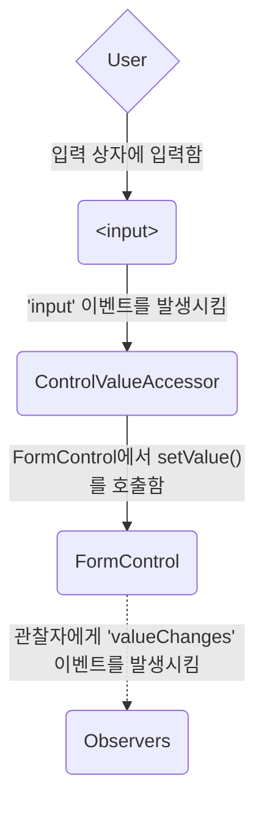
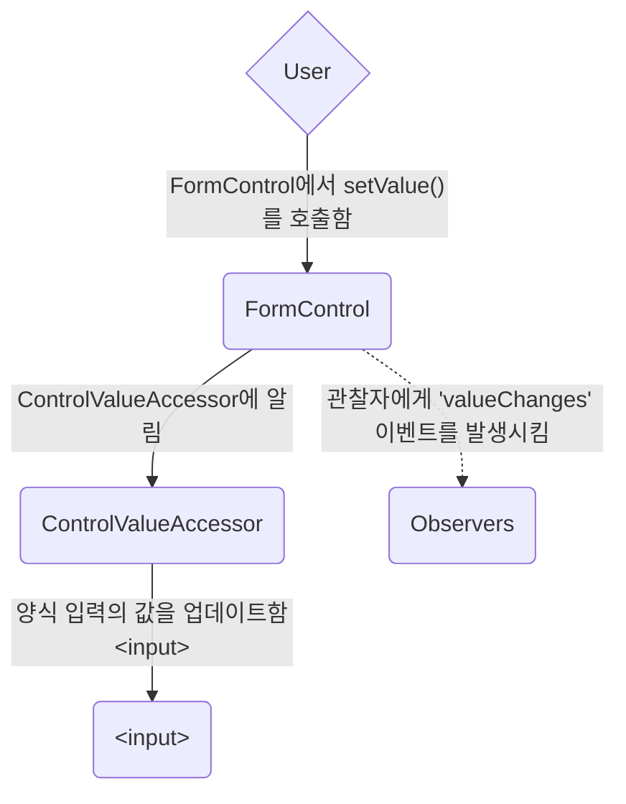
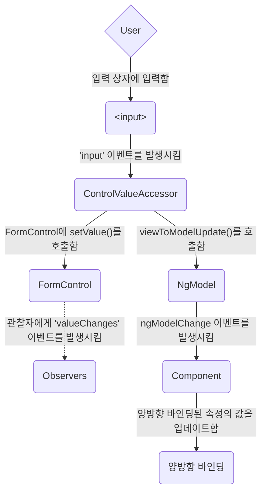
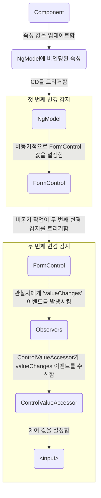

<docs-decorative-header title="Angular의 양식" imgSrc="adev/src/assets/images/overview.svg"> <!-- markdownlint-disable-line -->
사용자 입력을 양식으로 처리하는 것은 많은 일반 애플리케이션의 초석입니다.
</docs-decorative-header>

애플리케이션은 양식을 사용하여 사용자가 로그인하고, 프로필을 업데이트하고, 민감한 정보를 입력하며, 많은 다른 데이터 입력 작업을 수행할 수 있게 합니다.

Angular는 양식을 통해 사용자 입력을 처리하는 두 가지 접근 방식을 제공합니다: 반응형 및 템플릿 기반.
두 방법 모두 보기에서 사용자 입력 이벤트를 포착하고, 사용자 입력을 검증하며, 업데이트할 양식 모델 및 데이터 모델을 생성하고, 변경 사항을 추적할 수 있는 방법을 제공합니다.

이 가이드는 귀하의 상황에 가장 적합한 양식 유형을 결정하는 데 도움을 주기 위한 정보를 제공합니다.
두 접근 방식에서 사용되는 일반적인 빌딩 블록을 소개합니다.
또한 두 접근 방식 간의 주요 차이점을 요약하고, 설정, 데이터 흐름 및 테스트의 맥락에서 이러한 차이점을 보여줍니다.

## 접근 방식 선택

반응형 양식과 템플릿 기반 양식은 양식 데이터를 처리하고 관리하는 방식이 다릅니다.
각 접근 방식은 다른 이점을 제공합니다.

| 양식                 | 세부 정보 |
|:---                   |:---     |
| 반응형 양식         | 기본 양식의 객체 모델에 대한 직접적이고 명시적인 접근을 제공합니다. 템플릿 기반 양식에 비해 더 강력합니다: 더 확장 가능하고, 재사용 가능하며, 테스트 가능성이 높습니다. 양식이 애플리케이션의 핵심 부분인 경우, 또는 애플리케이션을 구성하는 데 반응형 패턴을 이미 사용하고 있는 경우 반응형 양식을 사용하십시오.                                                                                             |
| 템플릿 기반 양식     | 기본 객체 모델을 생성하고 조작하기 위해 템플릿의 지시문에 의존합니다. 이메일 목록 가입 양식과 같은 간단한 양식을 앱에 추가하는 데 유용합니다. 앱에 추가하기는 직관적이지만 반응형 양식만큼 확장성이 좋지 않습니다. 아주 기본적인 양식 요구 사항과 논리가 템플릿에서만 관리될 수 있는 경우 템플릿 기반 양식이 잘 맞을 수 있습니다. |

### 주요 차이점

다음 표는 반응형 양식과 템플릿 기반 양식 간의 주요 차이점을 요약합니다.

|                                                    | 반응형                             | 템플릿 기반                 |
|:---                                                |:---                                  |:---                             |
| [양식 모델 설정](#setting-up-the-form-model)  | 명시적이며, 컴포넌트 클래스에서 생성됨 | 암시적이며, 지시문에 의해 생성됨 |
| [데이터 모델](#mutability-of-the-data-model)        | 구조화되고 불변                     | 구조화되지 않고 가변          |
| [데이터 흐름](#data-flow-in-forms)                     | 동기                                | 비동기                        |
| [양식 검증](#form-validation)                | 함수                                | 지시문                        |

### 확장성

양식이 귀하 애플리케이션의 핵심 부분이라면, 확장성이 매우 중요합니다.
구성 요소 간에 양식 모델을 재사용할 수 있는 능력이 중요합니다.

반응형 양식은 템플릿 기반 양식보다 더 확장 가능합니다.
기본 양식 API에 직접 접근을 제공하고, 보기와 데이터 모델 간의 [동기 데이터 흐름](#data-flow-in-reactive-forms)을 사용하여 대규모 양식 생성을 더 쉽게 만듭니다.
반응형 양식은 테스트를 위한 설정이 적게 필요하며, 양식 업데이트 및 검증을 적절히 테스트하기 위해 변경 감지에 대한 깊은 이해가 필요하지 않습니다.

템플릿 기반 양식은 간단한 시나리오에 초점을 맞추고 있으며 그렇게 재사용 가능하지 않습니다.
기본 양식 API를 추상화하고, 보기와 데이터 모델 간의 [비동기 데이터 흐름](#data-flow-in-template-driven-forms)을 사용합니다.
템플릿 기반 양식의 추상화는 테스트에도 영향을 미칩니다.
테스트는 제대로 실행되기 위해 수동 변경 감지 실행에 깊게 의존하며, 더 많은 설정이 필요합니다.

## 양식 모델 설정

반응형 및 템플릿 기반 양식 모두 사용자가 상호 작용하는 양식 입력 요소와 컴포넌트 모델의 양식 데이터 간의 값 변경을 추적합니다.
두 접근 방식은 기본 빌딩 블록을 공유하지만, 공통의 양식 제어 인스턴스를 생성하고 관리하는 방식이 다릅니다.

### 공통 양식 기본 클래스

반응형 및 템플릿 기반 양식은 다음 기본 클래스를 기반으로 만들어집니다.

| 기본 클래스           | 세부 정보 |
|:---                    |:---     |
| `FormControl`          | 개별 양식 제어의 값과 검증 상태를 추적합니다.               |
| `FormGroup`            | 양식 제어의 컬렉션에 대한 동일한 값과 상태를 추적합니다.                |
| `FormArray`            | 양식 제어 배열에 대한 동일한 값과 상태를 추적합니다.                    |
| `ControlValueAccessor` | Angular `FormControl` 인스턴스와 내장 DOM 요소 간의 다리를 만듭니다. |

### 반응형 양식의 설정

반응형 양식에서는 양식 모델을 직접 컴포넌트 클래스에서 정의합니다.
`[formControl]` 지시문은 명시적으로 생성된 `FormControl` 인스턴스를 보기의 특정 양식 요소에 연결합니다.

다음 컴포넌트는 반응형 양식을 사용하여 단일 제어에 대한 입력 필드를 구현합니다.
이 예에서 양식 모델은 `FormControl` 인스턴스입니다.

<docs-code path="adev/src/content/examples/forms-overview/src/app/reactive/favorite-color/favorite-color.component.ts"/>

중요: 반응형 양식에서는 양식 모델이 진실의 원천입니다. 이것은 `<input>` 요소의 `[formControl]` 지시문을 통해 주어진 시점에서 양식 요소의 값과 상태를 제공합니다.

### 템플릿 기반 양식의 설정

템플릿 기반 양식에서는 양식 모델이 명시적이지 않고 암시적입니다.
`NgModel` 지시문은 주어진 양식 요소에 대한 `FormControl` 인스턴스를 생성하고 관리합니다.

다음 컴포넌트는 템플릿 기반 양식을 사용하여 단일 제어에 대한 동일한 입력 필드를 구현합니다.

<docs-code path="adev/src/content/examples/forms-overview/src/app/template/favorite-color/favorite-color.component.ts"/>

중요: 템플릿 기반 양식에서는 진실의 원천이 템플릿입니다. `NgModel` 지시문이 자동으로 `FormControl` 인스턴스를 관리합니다.

## 양식의 데이터 흐름

애플리케이션에 양식이 포함될 때, Angular는 보기를 컴포넌트 모델과 동기화하고 컴포넌트 모델과 보기를 동기화해야 합니다.
사용자가 보기에서 값을 변경하고 선택할 때, 새로운 값은 데이터 모델에 반영되어야 합니다.
비슷하게, 프로그램 로직이 데이터 모델의 값을 변경할 때, 그 값은 보기에도 반영되어야 합니다.

반응형 양식과 템플릿 기반 양식은 사용자 또는 프로그램적 변경으로부터의 데이터 흐름을 처리하는 방식이 다릅니다.
다음 다이어그램은 위에서 정의된 favorite-color 입력 필드를 사용하여 각 양식 유형에 대한 두 가지 종류의 데이터 흐름을 설명합니다.

### 반응형 양식의 데이터 흐름

반응형 양식에서는 보기의 각 양식 요소가 양식 모델(`FormControl` 인스턴스)에 직접 연결되어 있습니다.
모델로부터 보기로의 업데이트 및 보기로부터 모델로의 업데이트는 동기이며 UI가 렌더링되는 방식에 종속되지 않습니다.

보기-모델 다이어그램은 입력 필드의 값이 보기에서 변경될 때 데이터가 흐르는 방법을 보여줍니다.

1. 사용자가 입력 요소에 값을 입력합니다. 이 경우 선호하는 색상은 *파란색*입니다.
1. 양식 입력 요소는 최신 값과 함께 "input" 이벤트를 내보냅니다.
1. 양식 입력 요소의 이벤트를 듣고 있는 `ControlValueAccessor`가 새로운 값을 즉시 `FormControl` 인스턴스에 전달합니다.
1. `FormControl` 인스턴스는 `valueChanges` 옵저버블을 통해 새로운 값을 내보냅니다.
1. `valueChanges` 옵저버블의 모든 구독자는 새로운 값을 받습니다.

모델-보기 다이어그램은 모델에 대한 프로그램적 변경이 보기로 전파되는 방법을 보여줍니다.

1. 사용자가 `favoriteColorControl.setValue()` 메서드를 호출하여 `FormControl` 값을 업데이트합니다.
1. `FormControl` 인스턴스는 `valueChanges` 옵저버블을 통해 새로운 값을 내보냅니다.
1. `valueChanges` 옵저버블의 모든 구독자는 새로운 값을 받습니다.
1. 양식 입력 요소의 제어 값 접근자는 새로운 값으로 요소를 업데이트합니다.

### 템플릿 기반 양식의 데이터 흐름

템플릿 기반 양식에서는 각 양식 요소가 양식 모델을 내부적으로 관리하는 지시문에 연결됩니다.

보기-모델 다이어그램은 입력 필드의 값이 보기에서 변경될 때 데이터가 흐르는 방법을 보여줍니다.

1. 사용자가 입력 요소에 *파란색*을 입력합니다.
1. 입력 요소는 *파란색* 값을 가진 "input" 이벤트를 내보냅니다.
1. 입력에 연결된 제어 값 접근자가 `FormControl` 인스턴스에서 `setValue()` 메서드를 호출합니다.
1. `FormControl` 인스턴스는 `valueChanges` 옵저버블을 통해 새로운 값을 내보냅니다.
1. `valueChanges` 옵저버블의 모든 구독자는 새로운 값을 받습니다.
1. 제어 값 접근자는 `NgModel.viewToModelUpdate()` 메서드를 호출하여 `ngModelChange` 이벤트를 발생시킵니다.
1. 컴포넌트 템플릿에서 `favoriteColor` 속성에 대한 양방향 데이터 바인딩을 사용하므로, 컴포넌트 내의 `favoriteColor` 속성이 `ngModelChange` 이벤트에 의해 내보낸 값에 업데이트됩니다 \(*파란색*\).

모델-보기 다이어그램은 `favoriteColor`가 *파란색*에서 *빨간색*으로 변경될 때 데이터가 모델에서 보기로 흐르는 방법을 보여줍니다.

1. 컴포넌트에서 `favoriteColor` 값이 업데이트됩니다.
1. 변경 감지가 시작됩니다.
1. 변경 감지 동안 `NgModel` 지시문 인스턴스의 입력 값 중 하나가 변경되었기 때문에 `ngOnChanges` 생명 주기 후크가 호출됩니다.
1. `ngOnChanges()` 메서드는 내부 `FormControl` 인스턴스의 값 설정을 위한 비동기 작업을 큐에 추가합니다.
1. 변경 감지가 완료됩니다.
1. 다음 틱에서 `FormControl` 인스턴스 값을 설정하는 작업이 실행됩니다.
1. `FormControl` 인스턴스는 `valueChanges` 옵저버블을 통해 최신 값을 내보냅니다.
1. `valueChanges` 옵저버블의 모든 구독자는 새로운 값을 받습니다.
1. 제어 값 접근자는 보기의 양식 입력 요소를 최신 `favoriteColor` 값으로 업데이트합니다.

참고: `NgModel`은 입력 바인딩에서 값 변경이 발생하므로 `ExpressionChangedAfterItHasBeenChecked` 오류를 피하기 위해 두 번째 변경 감지를 트리거합니다.

### 데이터 모델의 가변성

변경 추적 방법은 애플리케이션의 효율성에 중요한 역할을 합니다.

| 양식                 | 세부 정보 |
|:---                   |:---     |
| 반응형 양식         | 데이터를 불변 데이터 구조로 제공하여 데이터 모델을 순수하게 유지합니다. 데이터 모델에서 변경이 촉발될 때마다 `FormControl` 인스턴스는 기존 데이터 모델을 업데이트하는 것이 아니라 새로운 데이터 모델을 반환합니다. 이를 통해 제어의 옵저버블을 통해 데이터 모델에 대한 고유한 변경 사항을 추적할 수 있습니다. 변경 감지는 고유한 변경 사항에서만 업데이트하면 되기 때문에 더 효율적입니다. 데이터 업데이트가 반응형 패턴을 따르기 때문에 옵저버블 연산자를 통합하여 데이터를 변환할 수 있습니다. |
| 템플릿 기반 양식     | 변경 사항이 템플릿에서 발생할 때 컴포넌트 내에서 데이터 모델을 업데이트하기 위해 양방향 데이터 바인딩을 통해 가변성을 유지합니다. 양방향 데이터 바인딩을 사용할 때 데이터 모델에서 추적할 고유한 변경 사항이 없기 때문에 변경 감지는 업데이트가 필요한 시기를 결정하는 데 덜 효율적입니다.                                                                                                                                                                                                                                 |

그 차이는 favorite-color 입력 요소를 사용하는 이전 예에서 보여집니다.

* 반응형 양식에서는 **`FormControl` 인스턴스**가 제어 값이 업데이트될 때마다 항상 새 값을 반환합니다.
* 템플릿 기반 양식에서는 **favorite color 속성**이 항상 새 값으로 수정됩니다.

## 양식 검증

검증은 모든 양식을 관리하는 데 중요한 부분입니다.
필수 필드를 확인하든 기존 사용자 이름을 위해 외부 API를 쿼리하든, Angular는 내장된 유효성 검사기 세트와 사용자 정의 유효성 검사기를 만들 수 있는 기능을 제공합니다.

| 양식                 | 세부 정보 |
|:---                   |:---     |
| 반응형 양식         | 유효성 검사할 제어를 수신하는 **함수**로 사용자 정의 유효성 검사기를 정의합니다.                                 |
| 템플릿 기반 양식     | 템플릿 **지시문**에 연결되어 있으며, 유효성 검사 함수를 래핑하는 사용자 정의 유효성 검사기 지시문을 제공해야 합니다. |

자세한 내용은 [양식 검증](guide/forms/form-validation#validating-input-in-reactive-forms)을 참고하세요.

## 테스트

테스트는 복잡한 애플리케이션에서 큰 비중을 차지합니다.
양식이 올바르게 작동하는지 검증할 때 더 간단한 테스트 전략이 유용합니다.
반응형 양식과 템플릿 기반 양식은 양식 제어 및 양식 필드 변경에 따라 UI를 렌더링할 의존성이 다릅니다.
다음 예는 반응형 양식과 템플릿 기반 양식으로 양식을 테스트하는 과정을 시연합니다.

### 반응형 양식 테스트

반응형 양식은 양식 및 데이터 모델에 대한 동기 액세스를 제공하고 사용자 인터페이스를 렌더링하지 않고도 테스트할 수 있기 때문에 상대적으로 간단한 테스트 전략을 제공합니다.
이 테스트에서는 변경 감지 주기와 상호 작용하지 않고 제어를 통해 상태와 데이터를 쿼리하고 조작합니다.

다음 테스트는 이전 예에서 favorite-color 구성 요소를 사용하여 반응형 양식의 보기-모델 및 모델-보기 데이터 흐름을 확인합니다.

<!--todo: make consistent with other topics -->

#### 보기-모델 데이터 흐름 검증

첫 번째 예는 보기-모델 데이터 흐름을 검증하기 위해 다음 단계를 수행합니다.

1. 양식 입력 요소에 대해 보기를 쿼리하고, 테스트를 위한 사용자 정의 "input" 이벤트를 생성합니다.
1. 입력의 새 값을 *빨간색*으로 설정하고, 양식 입력 요소에서 "input" 이벤트를 발생시킵니다.
1. 컴포넌트의 `favoriteColorControl` 값이 입력 값과 일치하는지 확인합니다.

<docs-code header="Favorite color test - view to model" path="adev/src/content/examples/forms-overview/src/app/reactive/favorite-color/favorite-color.component.spec.ts" visibleRegion="view-to-model"/>

다음 예는 모델-보기 데이터 흐름을 검증하기 위해 다음 단계를 수행합니다.

1. `FormControl` 인스턴스인 `favoriteColorControl`을 사용하여 새 값을 설정합니다.
1. 양식 입력 요소에 대해 보기를 쿼리합니다.
1. 제어에 설정된 새 값이 입력의 값과 일치하는지 확인합니다.

<docs-code header="Favorite color test - model to view" path="adev/src/content/examples/forms-overview/src/app/reactive/favorite-color/favorite-color.component.spec.ts" visibleRegion="model-to-view"/>

### 템플릿 기반 양식 테스트

템플릿 기반 양식으로 테스트를 작성하려면 변경 감지 프로세스에 대한 상세한 지식과 지시문이 각 사이클에서 어떻게 작동하는지를 이해해야 하며, 요소가 올바른 시간에 쿼리되고 테스트되거나 변경된다는 점을 보장해야 합니다.

다음 테스트는 이전에 언급된 favorite color 구성 요소를 사용하여 템플릿 기반 양식의 보기에서 모델로 흐르는 데이터와 모델에서 보기로 흐르는 데이터를 검증합니다.

다음 테스트는 보기에서 모델로의 데이터 흐름을 검증합니다.

<docs-code header="Favorite color test - view to model" path="adev/src/content/examples/forms-overview/src/app/template/favorite-color/favorite-color.component.spec.ts" visibleRegion="view-to-model"/>

여기서는 보기에서 모델 테스트를 수행하는 단계입니다.

1. 양식 입력 요소에 대해 보기를 쿼리하고, 테스트를 위한 사용자 정의 "input" 이벤트를 생성합니다.
1. 입력의 새 값을 *빨간색*으로 설정하고, 양식 입력 요소에서 "input" 이벤트를 발생시킵니다.
1. 테스트 장치를 통해 변경 감지를 실행합니다.
1. 컴포넌트의 `favoriteColor` 속성 값이 입력에서의 값과 일치하는지 확인합니다.

다음 테스트는 모델에서 보기로의 데이터 흐름을 검증합니다.

<docs-code header="Favorite color test - model to view" path="adev/src/content/examples/forms-overview/src/app/template/favorite-color/favorite-color.component.spec.ts" visibleRegion="model-to-view"/>

여기서는 모델에서 보기 테스트를 수행하는 단계입니다.

1. 컴포넌트 인스턴스를 사용하여 `favoriteColor` 속성의 값을 설정합니다.
1. 테스트 장치를 통해 변경 감지를 실행합니다.
1. `fakeAsync()` 작업 내에서 시간 경과를 시뮬레이션하기 위해 `tick()` 메서드를 사용합니다.
1. 양식 입력 요소에 대해 보기를 쿼리합니다.
1. 입력 값이 컴포넌트 인스턴스의 `favoriteColor` 속성 값과 일치하는지 확인합니다.

## 이후 단계

반응형 양식에 대해 더 알고 싶으시면 다음 가이드를 참조하세요:

<docs-pill-row>
  <docs-pill href="guide/forms/reactive-forms" title="반응형 양식"/>
  <docs-pill href="guide/forms/form-validation#validating-input-in-reactive-forms" title="양식 검증"/>
  <docs-pill href="guide/forms/dynamic-forms" title="동적 양식"/>
</docs-pill-row>

템플릿 기반 양식에 대해 더 알고 싶으시면 다음 가이드를 참조하세요:

<docs-pill-row>
  <docs-pill href="guide/forms/template-driven-forms" title="템플릿 기반 양식 튜토리얼" />
  <docs-pill href="guide/forms/form-validation#validating-input-in-template-driven-forms" title="양식 검증" />
  <docs-pill href="api/forms/NgForm" title="NgForm 지시문 API 참조" />
</docs-pill-row>