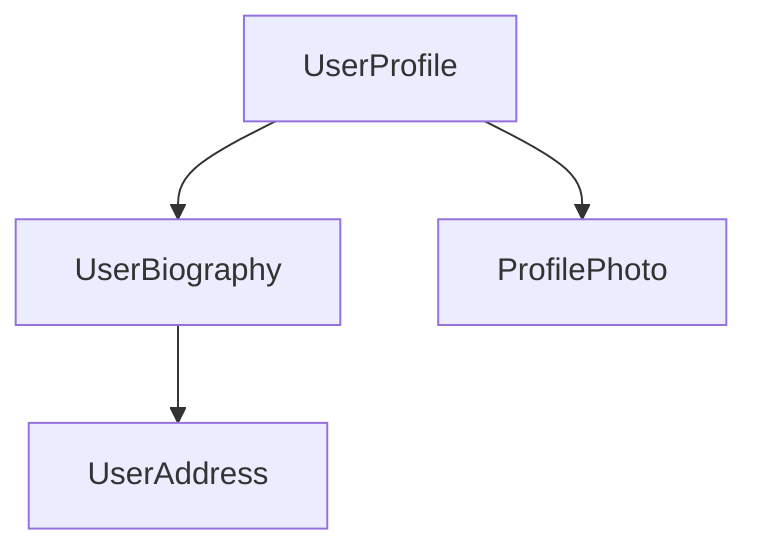

<docs-decorative-header title="Components" imgSrc="adev/src/assets/images/components.svg"> <!-- markdownlint-disable-line -->
앵귤러에서 애플리케이션을 만들기 위한 기본 빌딩 블록입니다.
</docs-decorative-header>

컴포넌트는 앵귤러 애플리케이션의 주요 빌딩 블록입니다. 각 컴포넌트는 더 큰 웹 페이지의 일부를 나타냅니다. 애플리케이션을 컴포넌트로 구성하면 프로젝트의 구조를 제공하고, 코드를 명확하게 특정 부분으로 분리하여 유지 관리하고 시간이 지남에 따라 성장하기 쉽게 도와줍니다.

## 컴포넌트 정의

모든 컴포넌트는 몇 가지 주요 부분을 가지고 있습니다:

1. 앵귤러에서 사용하는 일부 구성 정보를 포함하는 `@Component`[데코레이터](https://www.typescriptlang.org/docs/handbook/decorators.html).
2. DOM에 렌더링되는 내용을 제어하는 HTML 템플릿.
3. HTML에서 컴포넌트가 어떻게 사용되는지를 정의하는 [CSS 선택자](https://developer.mozilla.org/docs/Learn/CSS/Building_blocks/Selectors).
4. 사용자 입력 처리나 서버에 요청을 하는 등의 동작을 가진 TypeScript 클래스.

여기 `UserProfile` 컴포넌트의 간단한 예가 있습니다.

```angular-ts
// user-profile.ts
@Component({
  selector: 'user-profile',
  template: `
    <h1>사용자 프로필</h1>
    <p>이것은 사용자 프로필 페이지입니다</p>
  `,
})
export class UserProfile { /* 여기에 컴포넌트 코드가 들어갑니다 */ }
```

`@Component` 데코레이터는 템플릿에 적용할 CSS에 대한 `styles` 속성을 선택적으로 수용합니다:

```angular-ts
// user-profile.ts
@Component({
  selector: 'user-profile',
  template: `
    <h1>사용자 프로필</h1>
    <p>이것은 사용자 프로필 페이지입니다</p>
  `,
  styles: `h1 { font-size: 3em; } `,
})
export class UserProfile { /* 여기에 컴포넌트 코드가 들어갑니다 */ }
```

### HTML과 CSS를 별도의 파일로 분리하기

`templateUrl` 및 `styleUrl`을 사용하여 컴포넌트의 HTML 및 CSS를 별도의 파일로 정의할 수 있습니다:

```angular-ts
// user-profile.ts
@Component({
  selector: 'user-profile',
  templateUrl: 'user-profile.html',
  styleUrl: 'user-profile.css',
})
export class UserProfile {
  // 컴포넌트 동작이 여기에 정의됩니다
}
```

```angular-html
<!-- user-profile.html -->
<h1>사용자 프로필</h1>
<p>이것은 사용자 프로필 페이지입니다</p>
```

```css
/* user-profile.css */
h1 {
  font-size: 3em;
}
```

## 컴포넌트 사용하기

여러 컴포넌트를 결합하여 애플리케이션을 빌드합니다. 예를 들어, 사용자 프로필 페이지를 구축하는 경우 페이지를 여러 개의 컴포넌트로 나눌 수 있습니다:



여기서 `UserProfile` 컴포넌트는 여러 다른 컴포넌트를 사용하여 최종 페이지를 생성합니다.

컴포넌트를 가져오고 사용하려면 다음이 필요합니다:
1. 컴포넌트의 TypeScript 파일에서 사용하려는 컴포넌트에 대한 `import` 문을 추가합니다.
2. `@Component` 데코레이터에서 사용하려는 컴포넌트에 대한 `imports` 배열에 항목을 추가합니다.
3. 컴포넌트의 템플릿에서 사용하려는 컴포넌트의 선택자와 일치하는 요소를 추가합니다.

다음은 `ProfilePhoto` 컴포넌트를 가져오는 `UserProfile` 컴포넌트의 예입니다:

```angular-ts
// user-profile.ts
import {ProfilePhoto} from 'profile-photo.ts';

@Component({
  selector: 'user-profile',
  imports: [ProfilePhoto],
  template: `
    <h1>사용자 프로필</h1>
    <profile-photo />
    <p>이것은 사용자 프로필 페이지입니다</p>
  `,
})
export class UserProfile {
  // 컴포넌트 동작이 여기에 정의됩니다
}
```

팁: 앵귤러 컴포넌트에 대해 더 알고 싶나요? 전체 세부 정보를 보려면 [심층 컴포넌트 가이드](guide/components)를 참조하세요.

## 다음 단계

이제 앵귤러에서 컴포넌트가 어떻게 작동하는지 알았으므로, 애플리케이션에서 동적 데이터를 추가하고 관리하는 방법을 배워야 할 때입니다.

<docs-pill-row>
  <docs-pill title="신호를 통한 반응성" href="essentials/signals" />
  <docs-pill title="심층 컴포넌트 가이드" href="guide/components" />
</docs-pill-row>