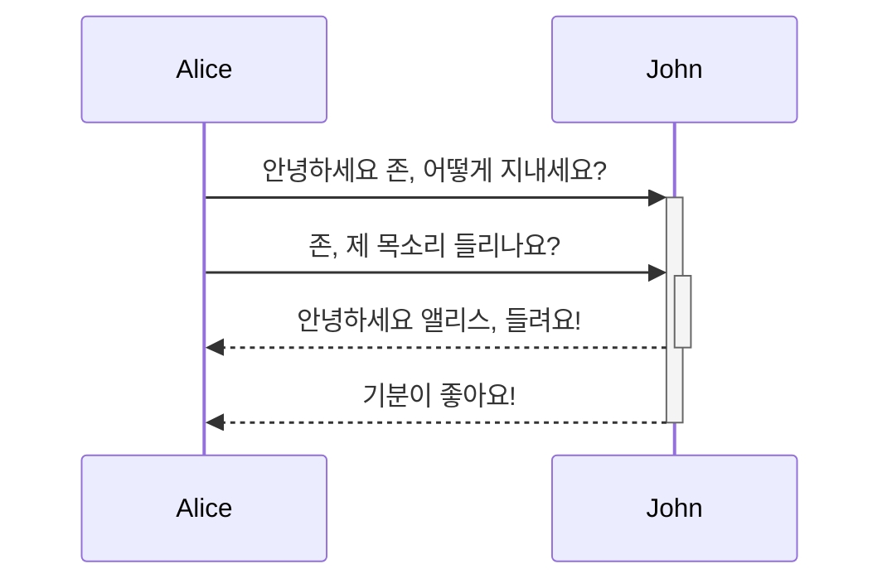
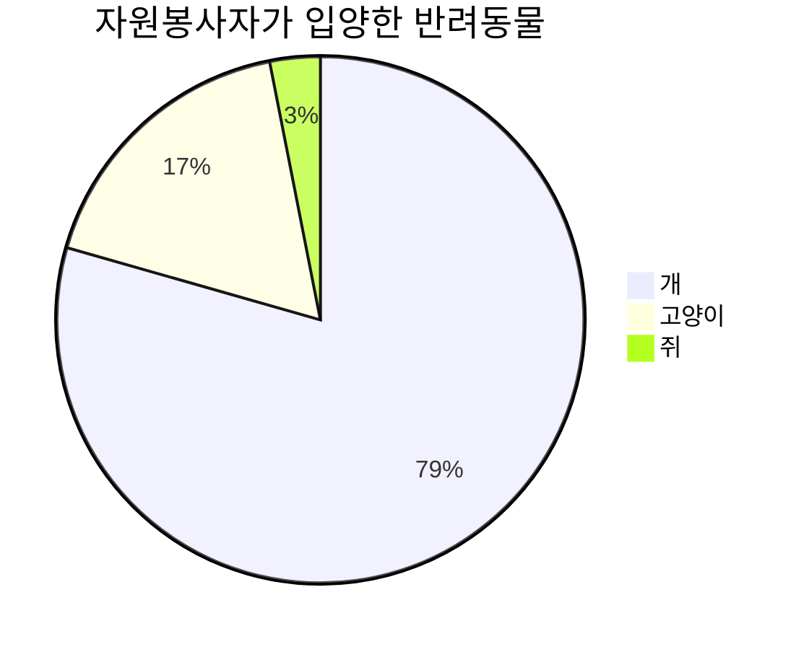

<docs-decorative-header title="주방 싱크대" imgSrc="assets/images/components.svg"> <!-- markdownlint-disable-line -->
이것은 Angular.dev를 위한 모든 사용자 정의 구성 요소 및 스타일의 비주얼 목록입니다.
</docs-decorative-header>

디자인 시스템으로서 이 페이지는 다음에 대한 시각적 및 Markdown 작성 지침을 포함합니다:

* 사용자 정의 Angular 문서 요소: [`docs-card`](#cards), [`docs-callout`](#callouts), [`docs-pill`](#pills), 및 [`docs-steps`](#workflow)
* 사용자 정의 텍스트 요소: [알림](#alerts)
* 코드 예제: [`docs-code`](#code)
* 내장 Markdown 스타일 요소: 링크, 목록, [헤더](#headers), [수평선](#horizontal-line-divider), [테이블](#tables)
* 그 외에도 더 많은 것들!

준비하세요:

1. 작성하기...
2. 훌륭한...
3. 문서!

## 헤더 (h2)

### 작은 헤더 (h3)

#### 더 작은 헤더 (h4)

##### 더 더 작은 헤더 (h5)

###### 가장 작은 헤더! (h6)

## 카드

<docs-card-container>
  <docs-card title="Angular란 무엇인가?" link="플랫폼 개요" href="tutorials/first-app">
    Lorem ipsum dolor sit amet, consectetur adipiscing elit. Nullam ornare ligula nisi
  </docs-card>
  <docs-card title="두 번째 카드" link="지금 시도하기" href="essentials/what-is-angular">
    Lorem ipsum dolor sit amet, consectetur adipiscing elit. Nullam ornare ligula nisi
  </docs-card>
    <docs-card title="링크 없는 카드">
    Lorem ipsum dolor sit amet, consectetur adipiscing elit. Nullam ornare ligula nisi
  </docs-card>
</docs-card-container>

### `<docs-card>` 속성

| 속성                     | 세부사항                                        |
|:---                      |:---                                            |
| `<docs-card-container>`  | 모든 카드는 컨테이너 내부에 중첩되어야 합니다.   |
| `title`                  | 카드 제목                                      |
| 카드 본문 내용          | `<docs-card>`와 `</docs-card>` 사이의 모든 것    |
| `link`                   | (선택적) 호출 행동 링크 텍스트                |
| `href`                   | (선택적) 호출 행동 링크 href                  |

## 호출 알림

<docs-callout title="도움이 되는 호출 알림 제목">
  Lorem ipsum dolor sit amet, consectetur adipiscing elit. Nulla luctus metus blandit semper faucibus. Sed blandit diam quis tellus maximus, ac scelerisque ex egestas. Ut euismod lobortis mauris pretium iaculis. Quisque ullamcorper, elit ut lacinia blandit, magna sem finibus urna, vel suscipit tortor dolor id risus.
</docs-callout>

<docs-callout critical title="중요한 호출 알림 제목">
  Lorem ipsum dolor sit amet, consectetur adipiscing elit. Nulla luctus metus blandit semper faucibus. Sed blandit diam quis tellus maximus, ac scelerisque ex egestas. Ut euismod lobortis mauris pretium iaculis. Quisque ullamcorper, elit ut lacinia blandit, magna sem finibus urna, vel suscipit tortor dolor id risus.
</docs-callout>

<docs-callout important title="중요한 호출 알림 제목">
  Lorem ipsum dolor sit amet, consectetur adipiscing elit. Nulla luctus metus blandit semper faucibus. Sed blandit diam quis tellus maximus, ac scelerisque ex egestas. Ut euismod lobortis mauris pretium iaculis. Quisque ullamcorper, elit ut lacinia blandit, magna sem finibus urna, vel suscipit tortor dolor id risus.
</docs-callout>

### `<docs-callout>` 속성

| 속성                                       | 세부사항                                                   |
|:---                                        |:---                                                       |
| `title`                                    | 호출 알림 제목                                           |
| 카드 본문 내용                             | `<docs-callout>`와 `</docs-callout>` 사이의 모든 것      |
| `helpful` (기본값) \| `critical` \| `important` | (선택적) 심각도 수준에 따라 스타일 및 아이콘 추가      |

## 알약

알약 행은 유용한 리소스에 대한 링크로 내비게이션의 일종으로 유용합니다.

<docs-pill-row>
  <docs-pill href="#pill-row" title="링크"/>
  <docs-pill href="#pill-row" title="링크"/>
  <docs-pill href="#pill-row" title="링크"/>
  <docs-pill href="#pill-row" title="링크"/>
  <docs-pill href="#pill-row" title="링크"/>
  <docs-pill href="#pill-row" title="링크"/>
</docs-pill-row>

### `<docs-pill>` 속성

| 속성                     | 세부사항                                     |
|:---                      |:---                                         |
| `<docs-pill-row>`        | 모든 알약은 알약 행 내부에 중첩되어야 합니다.|
| `title`                  | 알약 텍스트                                 |
| `href`                   | 알약 href                                   |

알약은 혼자서 인라인으로도 사용할 수 있지만, 그 기능은 아직 구축되지 않았습니다.

## 알림

알림은 특별한 문단일 뿐입니다. 긴급한 내용을 강조하기 위해 유용하며, 상황에 따라 글꼴 크기를 조정할 수 있습니다. 너무 많은 내용을 표시하기 위해 알림을 사용하지 않도록 하고, 주변 콘텐츠를 강조하는 데 사용하세요.

Markdown에서 `SEVERITY_LEVEL` + `:` + `ALERT_TEXT` 형식으로 새 줄에서 알림 스타일을 지정하세요.

참고: 본문 텍스트에 _필수_가 아닌 보조/추가 정보를 위해 Note를 사용하세요.

팁: 특정 작업/행동을 호출하거나 작업/행동에 직접 연결되는 사실을 강조하는 데 Tip을 사용하세요.

TODO: 곧 확장할 예정인 미완의 문서에 대해 TODO를 사용하세요. 예: TODO(emmatwersky): 텍스트.

질문: 독자에게 질문을 제기하는 데 Question을 사용하세요. 독자가 답변할 수 있어야 하는 미니 퀴즈처럼요.

요약: 페이지나 섹션 콘텐츠의 2~3문 장 요약을 제공하는 데 Summary를 사용하세요. 독자가 이곳이 적합한지 알아볼 수 있도록 합니다.

TLDR: 페이지나 섹션에 대한 필수 정보를 한두 문장으로 제공할 수 있으면 TL;DR(또는 TLDR)을 사용하세요. 예: TLDR: Rhubarb은 고양이입니다.

CRITICAL: 잠재적인 나쁜 사항을 강조하거나 무언가를 수행하기 전에 조심해야 한다는 것을 독자에게 경고하는 데 Critical을 사용하세요. 예: 경고: `rm`을 `-f` 옵션과 함께 실행하면, 확인 없이 쓰기 보호된 파일이나 디렉터리가 삭제됩니다.

IMPORTANT: 텍스트를 이해하거나 일부 작업을 완료하는 데 중요한 정보를 위해 Important를 사용하세요.

HELPFUL: 성공적인 것으로 알려지거나 대안보다 더 나은 관행을 호출하기 위해 Best practice를 사용하세요.

참고: 개발자 여러분! 알림은 **가능하면 최소한** 사용할 것 및 기타 중첩 스타일을 가질 수 있습니다.

## 코드

내장된 트리플 백틱을 사용하여 `code`를 표시할 수 있습니다:

```ts
예제 코드
```

또는 `<docs-code>` 요소를 사용하여 표시할 수 있습니다.

<docs-code header="당신의 첫 번째 예제" language="ts" linenums>
import { Component } from '@angular/core';

@Component({
  selector: 'example-code',
  template: '<h1>안녕하세요!</h1>',
})
export class ComponentOverviewComponent {}
</docs-code>

### 예제 스타일 지정

다음은 완전히 스타일된 코드 예제입니다:

<docs-code
  path="hello-world/src/app/app.component-old.ts"
  header="스타일이 적용된 코드 예제"
  language='ts'
  linenums
  highlight="[[14,19], 27]"
  diff="hello-world/src/app/app.component.ts"
  preview
  visibleLines="[13,28]">
</docs-code>

터미널에 대한 스타일도 있으며, 언어를 `shell`로 설정하세요:

<docs-code language="shell">
  npm install @angular/material --save
</docs-code>

#### `<docs-code>` 속성

| 속성                     | 유형        | 세부사항                                              |
|:---                      |:---         |:---                                                  |
| 코드                     | `string`    | 태그 사이의 모든 것은 코드로 처리됨                 |
| `path`                   | `string`    | 코드 예제의 경로 (루트: `content/examples/`)         |
| `header`                 | `string`    | 예제의 제목 (기본값: `file-name`)                   |
| `language`               | `string`    | 코드 언어                                            |
| `linenums`               | `boolean`   | (False) 줄 번호 표시                              |
| `highlight`              | `string of number[]` | 강조된 줄                           |
| `diff`                   | `string`    | 변경된 코드의 경로                                   |
| `visibleLines`           | `string of number[]` | 포괄 모드의 줄 범위                     |
| `visibleRegion`          | `string`    | `visibleLines`의 **폐기된**                         |
| `preview`                | `boolean`   | (False) 미리보기 표시                                |

### 다중 파일 예제

예제를 `<docs-code-multifile>` 내에 래핑하여 다중 파일 예제를 만들 수 있습니다.

<docs-code-multifile
  path="hello-world/src/app/app.component.ts"
  preview>
  <docs-code
    path="hello-world/src/app/app.component-old.ts"
    diff="hello-world/src/app/app.component.ts"
    visibleLines="[11, [13, 31]]"/>
  <docs-code
    path="hello-world/src/app/app.component.html"
    visibleLines="[1, 2]"
    linenums/>
  <docs-code
    path="hello-world/src/app/app.component.css"
    highlight="[2]"/>
</docs-code-multifile>

#### `<docs-code-multifile>` 속성

| 속성                     | 유형        | 세부사항                                          |
|:---                      |:---         |:---                                              |
| 본문 내용                | `string`    | 중첩된 `docs-code` 예제의 탭                      |
| `path`                   | `string`    | 미리보기 및 외부 링크를 위한 코드 예제의 경로      |
| `preview`                | `boolean`   | (False) 미리보기 표시                            |

### 코드 예제에 `preview` 추가하기

`preview` 플래그를 추가하면 코드 스니펫 아래에 코드의 실행 예제를 빌드합니다. 이렇게 하면 실행 예제를 Stackblitz에서 열 수 있는 버튼도 자동으로 추가됩니다.

참고: `preview`는 독립 실행형에서만 작동합니다.

#### 내장된 템플릿 함수

<docs-code-multifile
  path="built-in-template-functions/src/app/app.component.ts"
  preview>
  <docs-code
    path="built-in-template-functions/src/app/app.component.ts" linenums/>
  <docs-code
    path="built-in-template-functions/src/app/app.component.html"
    linenums/>
</docs-code-multifile>

#### 사용자 입력

<docs-code-multifile
  path="user-input/src/app/app.component.ts"
  preview>
  <docs-code
    path="user-input/src/app/app.component.ts" linenums/>
  <docs-code
    path="user-input/src/app/app.component.html"
    visibleLines="[10, 19]"
    linenums/>
  <docs-code
    path="user-input/src/app/click-me.component.ts" linenums/>
  <docs-code
    path="user-input/src/app/click-me2.component.ts" linenums/>
</docs-code-multifile>

## 워크플로우

`<docs-step>`을 사용하여 번호 매겨진 단계를 스타일링합니다. 번호 매기기는 CSS를 사용하여 생성됩니다(편리합니다!).

### `<docs-workflow>` 및 `<docs-step>` 속성

| 속성                     | 세부사항                                        |
|:---                      |:---                                            |
| `<docs-workflow>`        | 모든 단계는 워크플로우 내부에 중첩되어야 합니다.   |
| `title`                  | 단계 제목                                      |
| 단계 본문 내용          | `<docs-step>`와 `</docs-step>` 사이의 모든 것    |

단계는 새 줄에서 시작해야 하며, `docs-code` 및 기타 중첩 요소와 스타일을 포함할 수 있습니다.

<docs-workflow>

<docs-step title="Angular CLI 설치">
  Angular CLI를 사용하여 프로젝트를 생성하고, 애플리케이션 및 라이브러리 코드를 생성하며, 테스트, 번들링 및 배포와 같은 다양한 개발 작업을 수행합니다.

  Angular CLI를 설치하려면, 터미널 창을 열고 다음 명령어를 실행하세요:

  <docs-code language="shell">
    npm install -g @angular/cli
  </docs-code>
</docs-step>

<docs-step title="작업 공간 및 초기 애플리케이션 생성">
  Angular 작업 공간의 컨텍스트 내에서 앱을 개발합니다.

  새 작업 공간 및 초기 스타터 앱을 생성하려면:

* CLI 명령어 `ng new`를 실행하고 이름 `my-app`을 제공해주세요:
    <docs-code language="shell">
      ng new my-app
    </docs-code>

* ng new 명령어는 초기 앱에 포함할 기능에 대한 정보를 요청합니다. Enter 또는 Return 키를 눌러 기본값을 수락하십시오.

  Angular CLI는 필요한 Angular npm 패키지 및 기타 종속성을 설치합니다. 이 과정은 몇 분이 걸릴 수 있습니다.

  CLI는 새로운 작업 공간과 간단한 환영 앱을 생성하며, 실행 준비가 완료됩니다.
</docs-step>

<docs-step title="애플리케이션 실행">
  Angular CLI에는 로컬에서 앱을 빌드하고 제공하는 서버가 포함되어 있습니다.

  1. 작업 공간 폴더로 이동하십시오. 예: `my-app`.
  2. 다음 명령어를 실행하세요:
    <docs-code language="shell">
      cd my-app
      ng serve --open
    </docs-code>

  `ng serve` 명령어는 서버를 시작하고, 파일을 감시하며 파일에 변경 사항이 생길 때 앱을 다시 빌드합니다.

  `--open`(또는 단순히 `-o`) 옵션은 자동으로 브라우저를 <http://localhost:4200/>에 엽니다.
  설치 및 설정이 성공적이었다면, 아래와 비슷한 페이지를 볼 수 있어야 합니다.
</docs-step>

<docs-step title="마지막 단계">
  이제 모든 문서 구성 요소가 준비되었습니다! 이제:

  <docs-pill-row>
    <docs-pill href="#pill-row" title="가세요"/>
    <docs-pill href="#pill-row" title="작성하세요"/>
    <docs-pill href="#pill-row" title="훌륭한"/>
    <docs-pill href="#pill-row" title="문서!"/>
  </docs-pill-row>
</docs-step>

</docs-workflow>

## 이미지 및 비디오

Markdown 이미지로 이미지를 추가할 수 있습니다:


### 이미지 크기 변경을 위해 `#small` 및 `#medium` 추가


임베드된 비디오는 `docs-video`를 사용하여 생성되며 `src`와 `alt`만 필요합니다:

<docs-video src="https://www.youtube.com/embed/O47uUnJjbJc" alt=""/>

## 차트 및 그래프

[Mermaid](http://mermaid.js.org/)를 사용하여 다이어그램 및 차트를 작성하세요. 코드 언어를 `mermaid`로 설정하면 모든 테마가 내장됩니다.






## 수평선 구분자

페이지 섹션을 분리하는 데 사용할 수 있으며, 아래와 같이 사용할 수 있습니다. 이러한 스타일은 기본적으로 추가됩니다. 추가적인 사용자 지정은 필요하지 않습니다.

<hr/>

끝!